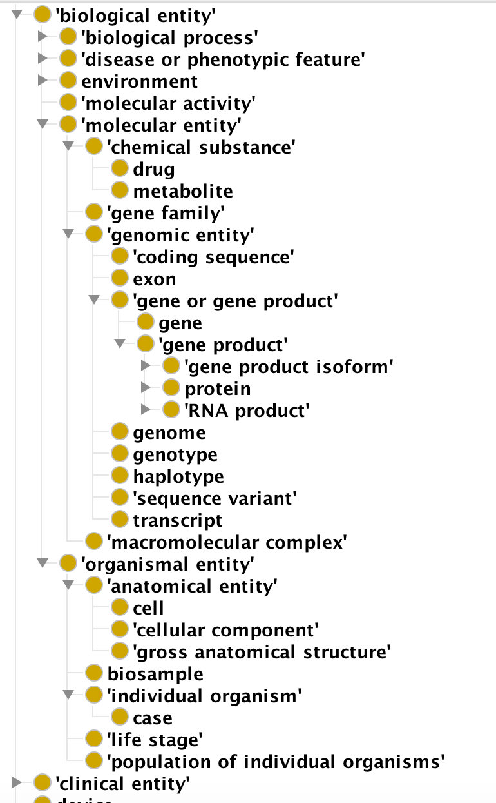

[](https://travis-ci.org/biolink/biolink-model)
[](https://zenodo.org/badge/latestdoi/112995625)

# biolink-models

Quickstart docs:

 * Browse the model: [https://biolink.github.io/biolink-model](https://biolink.github.io/biolink-model)
    * [named thing](docs/NamedThing.html) (root class for all things)
    * [association](docs/Association.html) (root class for association types)
    * [predicates](docs#slots)

See the [slides](https://www.slideshare.net/cmungall/introduction-to-the-biolink-datamodel)

Conversion/validation code: https://github.com/NCATS-Tangerine/kgx

## Introduction

The purpose of the biolink datamodel is to provide a high level
datamodel of biological entities (genes, diseases, phenotypes,
pathways, individuals, substances, etc), their properties,
relationships, and ways in which they can be associated.

The representation is independent of storage technology or metamodel
(solr/documents, neo4j/property graphs, RDF/OWL, JSON, CSVs,
etc). Different mappings to each of these are provided.

The specification of the reference biolink model is a [single YAML
file](biolink-model.yaml) following a custom meta-model. The basic
elements of the YAML are:

 - definitions of upper level *classes* representing both named things
(genes, phenotypes, etc) and associations between them
 - definitions of *slots* (aka properties) that can be used to relate
   members of these classes to other classes or datatypes

This datamodel is being used in the NCATS Translator project. Not all
these elements in the datamodel are used by the Translator, a subset
is used.

### Entity (Node) Types

 * [named thing](docs/NamedThing.html) (root class for all things)

Protege view:



### Property and Edge Types

 * [predicates](docs#slots)

We divide these into *relationship types* which connect two nodes together, and *node or edge properties*


### Association Hierarchy

 * [association](docs/Association.html) (root class for association types)

## Identifiers

See [biolink json-ld context](context.jsonld)

## Mapping to specific database and modeling platforms

### Neo4J Mapping

See [mapping to neo4j](https://biolink.github.io/biolink-model/about/mapping-neo4j.html)

### RDF Mapping

See [mapping to neo4j](https://biolink.github.io/biolink-model/about/mapping-rdf.html)


## Organization

The datamodel source is [biolink-model.yaml](biolink-model.yaml). This
is a yaml file that is intended to be relatively simple to view and
edit in its native form.

The yaml definition is currently used to derive:

 - [golr-yaml schemas](../golr-views)
    - these can be compiled down to solr xml schemas
    - these are also intermediate targets used within the bbop/amigo framework
 - [json-schema](../json-schema)
 - [python object model](../biolinkmodel/datamodel.py)
 - [marshmallow schema definitions](../biolinkmodel/schema.py)
    - can be used to serialize/deserialize python object model to json and yaml
 - [java code gen](../java-gen)
    - Jackson bindings used be defau;t
    - generated from json-schema
 - [ontology](../ontology)
 - [graphviz](../graphviz) to replace existing cmaps
 - markdown docs
 - JSON-LD contexts (TODO)

We leverage existing frameworks where possible. E.g json-schema allows
codegen to other languages

Additionally, this repo contains the metamodel definition of itself in
yaml, together with code for working with datamodels. In theory this
could be used in other domains but there is no plan for this at the
moment.

## Metamodel

See [metamodel](metamodel) for details of the metamodel.

## Usage in existing projects

### Case study: gene expression in Monarch

Currently this is documented in the [ingest
artefacts](https://github.com/monarch-initiative/ingest-artifacts/tree/master/sources)
repo, using non-computable cmap images:


And also by the [gene-anatomy cypher query](https://github.com/monarch-initiative/monarch-cypher-queries/blob/master/src/main/cypher/golr-loader/gene-anatomy.yaml)
which maps graphs conforming to the pattern to denormalized tuples for indexing in solr

in the biolink model this is explicitly represented using the `gene to expression site association` class definition [in the model](biolink-model.yaml)

```yaml
  - name: gene to expression site association
    is_a: association
    description: >-
      An association between a gene and an expression site, possibly qualified by stage/timing info
    see_also: "https://github.com/monarch-initiative/ingest-artifacts/tree/master/sources/BGee"
    slot_usage:
      - slot: subject
        type: gene or gene product
        description: "gene in which variation is correlated with the phenotypic feature"
      - slot: object
        type: anatomical entity
        description: "location in which the gene is expressed"
        subclass_of: UBERON:0001062
        examples:
          - value: UBERON:0002037
            description: cerebellum
      - slot: relation
        description: "expression relationship"
        subproperty_of: "RO:0002206"
      - slot: stage
        type: developmental stage
        description: "stage at which the gene is expressed in the site"
        examples:
          - value: UBERON:0000069
            description: larval stage
      - slot: quantifier
        description: >-
          can be used to indicate magnitude, or also ranking
```

This is used to generate various artefacts such as

 - [golr view definition](monarch/golr-views/gene_to_expression_site_association-config.yaml)
    - (which is itself later compiled to solr xml using the bbop-golr framework)
 - [java class](monarch/java-gen/GeneToExpressionSiteAssociation.java)
    - generated from json-schema, so inheritance is unfolded
    - in future we may generate directly

Auto-generated image:


```graphql
type GeneToExpressionSiteAssociation {
  qualifiers: [String]
  stageQualifier: LifeStage
  objectExtensions: [PropertyValuePair]
  hasEvidence: String
  publications: [Publication]
  object: AnatomicalEntity!
  hasEvidenceType: EvidenceType
  hasEvidenceGraph: String
  providedBy: Provider
  label: String
  relation: String!
  negated: String
  subject: GeneOrGeneProduct!
  id: String!
  quantifierQualifier: String
  associationType: String
  subjectExtensions: [PropertyValuePair]
}
```

snippet of [generated json-schema](../json-schema)

```json
        "GeneToExpressionSiteAssociation": {
            "description": "An association between a gene and an expression site, possibly qualified by stage/timing info. TBD: introduce subclasses for distinction between wild-type and experimental conditions?",
            "properties": {
                "association_type": {
                    "description": "connects an association to the type of association (e.g. gene to phenotype)",
                    "type": "string"
                },
                "has_evidence": {
                    "description": "connects an association to an instance of supporting evidence",
                    "type": "string"
                },
                "has_evidence_graph": {
                    "description": "connects an association to a graph object including a path from subject to object",
                    "type": "string"
                },
                "has_evidence_type": {
                    "description": "connects an association to the class of evidence used",
                    "type": "string"
                },
                "id": {
                    "type": "string"
                },
                "label": {
                    "description": "A human-readable name for a thing",
                    "type": "string"
                },
                "negated": {
                    "description": "if set to true, then the association is negated i.e. is not true",
                    "type": "string"
                },
                "object": {
                    "description": "connects an association to the object of the association. For example, in a gene-to-phenotype association, the gene is subject and phenotype is object.",
                    "type": "string"
                },
                "object_extensions": {
                    "description": "Additional relationships that are true of the object in the context of the association. For example, if the object is an anatomical term in an expression association, the object extensions may include part-of links",
                    "items": {
                        "type": "string"
                    },
                    "type": "array"
                },
                "provided_by": {
                    "description": "connects an association to the agent (person, organization or group) that provided it",
                    "type": "string"
                },
                "publications": {
                    "description": "connects an association to publications supporting the association",
                    "items": {
                        "type": "string"
                    },
                    "type": "array"
                },
                "qualifiers": {
                    "description": "connects an association to qualifiers that modify or qualify the meaning of that association",
                    "items": {
                        "type": "string"
                    },
                    "type": "array"
                },
                "quantifier_qualifier": {
                    "description": "A measurable quantity for the object of the association",
                    "type": "string"
                },
                "relation": {
                    "description": "the relationship type by which a subject is connected to an object in an association",
                    "type": "string"
                },
                "stage_qualifier": {
                    "description": "stage at which expression takes place",
                    "type": "string"
                },
                "subject": {
                    "description": "connects an association to the subject of the association. For example, in a gene-to-phenotype association, the gene is subject and phenotype is object.",
                    "type": "string"
                },
                "subject_extensions": {
                    "description": "Additional relationships that are true of the subject in the context of the association. For example, if the subject is a gene product in a functional association, the subject extensions may represent  an isoform or a specific post-translational state",
                    "items": {
                        "type": "string"
                    },
                    "type": "array"
                }
            },
            "required": [],
            "title": "GeneToExpressionSiteAssociation",
            "type": "object"
        },
```

## FAQ

### Why not use X as the modeling framework?

Why invent our own yaml and not use JSON-Schema, SQL, UML, ProtoBuf,
OWL, ...

each of these is tied to a particular formalisms. E.g. JSON-Schema to
trees. OWL to open world logic. There are various impedance mismatches
in converting between these. The goal was to develop something simple
and more general that is not tied to any one serialization format or
set of assumptions.

There are other projects with similar goals, e.g
https://github.com/common-workflow-language/schema_salad

It may be possible to align with these.

### Why not use X as the datamodel

Here X may be bioschemas, some upper ontology (BioTop), UMLS
metathesaurus, bio*, various other attempts to model all of biology in
an object model.

Currently as far as we know there is no existing reference datamodel
that is flexible enough to be used here.

