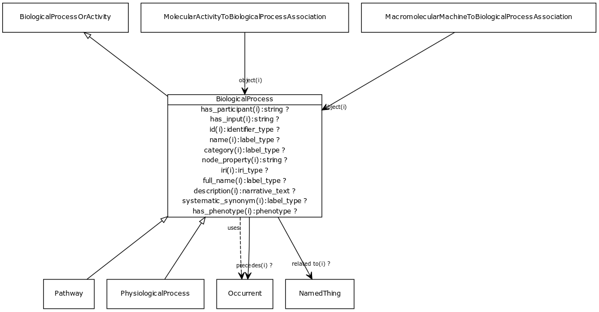

# Class: biological process

One or more causally connected executions of molecular functions

URI: [http://bioentity.io/vocab/BiologicalProcess](http://bioentity.io/vocab/BiologicalProcess)

## Mappings

 * [GO:0008150](http://purl.obolibrary.org/obo/GO_0008150)
 * [SIO:000006](http://semanticscience.org/resource/SIO_000006)
 * [WD:Q2996394](http://purl.obolibrary.org/obo/WD_Q2996394)
## Inheritance

 *  is_a: [BiologicalProcessOrActivity](BiologicalProcessOrActivity.md) - Either an individual molecular activity, or a collection of causally connected molecular activities
 *  mixin: [Occurrent](Occurrent.md) - A processual entity
## Children

 * [Pathway](Pathway.md)
 * [PhysiologicalProcess](PhysiologicalProcess.md)
## Used in

 *  class: **[MacromolecularMachineToBiologicalProcessAssociation](MacromolecularMachineToBiologicalProcessAssociation.md)** *[macromolecular machine to biological process association.object](macromolecular_machine_to_biological_process_association_object.md)* **[BiologicalProcess](BiologicalProcess.md)**
 *  class: **[MolecularActivityToBiologicalProcessAssociation](MolecularActivityToBiologicalProcessAssociation.md)** *[molecular activity to biological process association.object](molecular_activity_to_biological_process_association_object.md)* **[BiologicalProcess](BiologicalProcess.md)**
## Fields

 * _[category](category.md) *subsets*: (translator_minimal)_
    * _Name of the high level ontology class in which this entity is categorized. Corresponds to the label for the biolink entity type class. In a neo4j database this MAY correspond to the neo4j label tag_
    * range: [LabelType](LabelType.md)
    * inherited from: [NamedThing](NamedThing.md)
 * _[description](description.md) *subsets*: (translator_minimal)_
    * _a human-readable description of a thing_
    * range: [NarrativeText](NarrativeText.md)
    * inherited from: [NamedThing](NamedThing.md)
 * _[full name](full_name.md)_
    * _a long-form human readable name for a thing_
    * range: [LabelType](LabelType.md)
    * inherited from: [NamedThing](NamedThing.md)
 * _[has input](has_input.md) *subsets*: (translator_minimal)_
    * _holds between a process and a continuant, where the continuant is an input into the process_
    * range: **string**
    * inherited from: [Occurrent](Occurrent.md)
 * _[has participant](has_participant.md) *subsets*: (translator_minimal)_
    * _holds between a process and a continuant, where the continuant is somehow involved in the process _
    * range: **string**
    * inherited from: [Occurrent](Occurrent.md)
 * _[has phenotype](has_phenotype.md) *subsets*: (translator_minimal)_
    * _holds between a biological entity and a phenotype, where a phenotype is construed broadly as any kind of quality of an organism part, a collection of these qualities, or a change in quality or qualities (e.g. abnormally increased temperature). _
    * range: [Phenotype](Phenotype.md)
    * inherited from: [BiologicalEntity](BiologicalEntity.md)
 * _[id](id.md) *subsets*: (translator_minimal)_
    * _A unique identifier for a thing. Must be either a CURIE shorthand for a URI or a complete URI_
    * range: [IdentifierType](IdentifierType.md)
    * inherited from: [NamedThing](NamedThing.md)
 * _[iri](iri.md) *subsets*: (translator_minimal)_
    * _An IRI for the node. This is determined by the id using expansion rules._
    * range: [IriType](IriType.md)
    * inherited from: [NamedThing](NamedThing.md)
 * _[name](name.md) *subsets*: (translator_minimal)_
    * _A human-readable name for a thing_
    * range: [LabelType](LabelType.md)
    * inherited from: [NamedThing](NamedThing.md)
 * _[node property](node_property.md)_
    * _A grouping for any property that holds between a node and a value_
    * range: **string**
    * inherited from: [NamedThing](NamedThing.md)
 * _[precedes](precedes.md) *subsets*: (translator_minimal)_
    * _holds between two processes, where one completes before the other begins_
    * range: [Occurrent](Occurrent.md)
    * inherited from: [Occurrent](Occurrent.md)
 * _[regulates, process to process](regulates_process_to_process.md) *subsets*: (translator_minimal)_
    * _describes an entity that has a direct affect on the state or quality of another existing entity. Use of the 'affects' predicate implies that the affected entity already exists, unlike predicates such as 'affects risk for' and 'prevents, where the outcome is something that may or may not come to be._
    * range: [Occurrent](Occurrent.md)
    * inherited from: [Occurrent](Occurrent.md)
 * _[related to](related_to.md)_
    * _A grouping for any relationship type that holds between any two things_
    * range: [NamedThing](NamedThing.md)
    * inherited from: [NamedThing](NamedThing.md)
 * _[systematic synonym](systematic_synonym.md)_
    * _more commonly used for gene symbols in yeast_
    * range: [LabelType](LabelType.md)
    * inherited from: [NamedThing](NamedThing.md)
