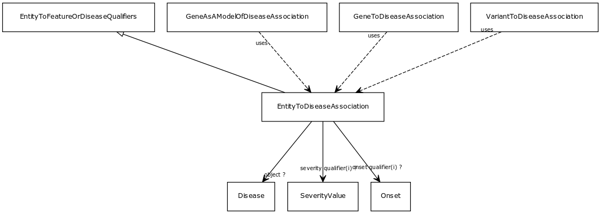

# Class: entity to disease association

mixin class for any association whose object (target node) is a disease

URI: [http://bioentity.io/vocab/EntityToDiseaseAssociation](http://bioentity.io/vocab/EntityToDiseaseAssociation)

## Mappings

## Inheritance

 *  is_a: [EntityToFeatureOrDiseaseQualifiers](EntityToFeatureOrDiseaseQualifiers.md) - Qualifiers for entity to disease or phenotype associations
## Children

 * [GeneAsAModelOfDiseaseAssociation](GeneAsAModelOfDiseaseAssociation.md) (mixin) 
 * [GeneToDiseaseAssociation](GeneToDiseaseAssociation.md) (mixin) 
 * [VariantToDiseaseAssociation](VariantToDiseaseAssociation.md) (mixin) 
## Used in

## Fields

 * _[entity to disease association.object](entity_to_disease_association_object.md)_
    * _disease_
    * range: [Disease](Disease.md) [required]
    * __Local__
 * _[onset qualifier](onset_qualifier.md)_
    * _a qualifier used in a phenotypic association to state when the phenotype appears is in the subject_
    * range: [Onset](Onset.md)
    * inherited from: [EntityToFeatureOrDiseaseQualifiers](EntityToFeatureOrDiseaseQualifiers.md)
 * _[severity qualifier](severity_qualifier.md)_
    * _a qualifier used in a phenotypic association to state how severe the phenotype is in the subject_
    * range: [SeverityValue](SeverityValue.md)
    * inherited from: [EntityToFeatureOrDiseaseQualifiers](EntityToFeatureOrDiseaseQualifiers.md)
