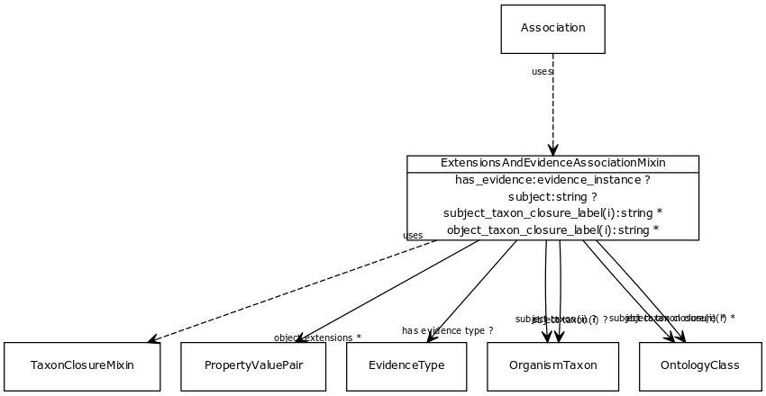

# Class: extensions and evidence association mixin

An injected mixing that adds additional fields to association objects. This is a mixture of (a) closures for denormalization (b) evidence fields specific to the GO model.

URI: [http://bioentity.io/vocab/ExtensionsAndEvidenceAssociationMixin](http://bioentity.io/vocab/ExtensionsAndEvidenceAssociationMixin)

## Mappings

## Inheritance

 *  mixin: [TaxonClosureMixin](TaxonClosureMixin.md) - An association that includes flattened inlined objects, such as subject_taxon_closure
## Children

 * [Association](Association.md) (mixin)  - A typed association between two entities, supported by evidence
## Used in

## Fields

 * _[extensions and evidence association mixin.subject](extensions_and_evidence_association_mixin_subject.md)_
    * _connects an association to the subject of the association. For example, in a gene-to-phenotype association, the gene is subject and phenotype is object._
    * range: **string** [required]
    * __Local__
 * _[has evidence](has_evidence.md)_
    * _connects an association to an instance of supporting evidence_
    * range: [EvidenceInstance](EvidenceInstance.md)
    * __Local__
 * _[has evidence type](has_evidence_type.md)_
    * _connects an association to the class of evidence used_
    * range: [EvidenceType](EvidenceType.md)
    * __Local__
 * _[object extensions](object_extensions.md)_
    * _Additional relationships that are true of the object in the context of the association. For example, if the object is an anatomical term in an expression association, the object extensions may include part-of links_
    * range: [PropertyValuePair](PropertyValuePair.md)*
    * __Local__
 * _[object taxon](object_taxon.md)_
    * _the taxonomic class of the entity in the object slot_
    * range: [OrganismTaxon](OrganismTaxon.md)
    * inherited from: [TaxonClosureMixin](TaxonClosureMixin.md)
 * _[object taxon closure](object_taxon_closure.md)_
    * _The taxon class or ancestor class for the object_
    * range: [OntologyClass](OntologyClass.md)*
    * inherited from: [TaxonClosureMixin](TaxonClosureMixin.md)
 * _[object taxon closure label](object_taxon_closure_label.md)_
    * _The label for the taxon class or ancestor class for the object_
    * range: **string***
    * inherited from: [TaxonClosureMixin](TaxonClosureMixin.md)
 * _[object taxon label](object_taxon_label.md)_
    * range: label
    * inherited from: [TaxonClosureMixin](TaxonClosureMixin.md)
 * _[subject taxon](subject_taxon.md)_
    * _the taxonomic class of the entity in the object slot_
    * range: [OrganismTaxon](OrganismTaxon.md)
    * inherited from: [TaxonClosureMixin](TaxonClosureMixin.md)
 * _[subject taxon closure](subject_taxon_closure.md)_
    * _The taxon class or ancestor class for the subject_
    * range: [OntologyClass](OntologyClass.md)*
    * inherited from: [TaxonClosureMixin](TaxonClosureMixin.md)
 * _[subject taxon closure label](subject_taxon_closure_label.md)_
    * _The label for the taxon class or ancestor class for the subject_
    * range: **string***
    * inherited from: [TaxonClosureMixin](TaxonClosureMixin.md)
 * _[subject taxon label](subject_taxon_label.md)_
    * range: label
    * inherited from: [TaxonClosureMixin](TaxonClosureMixin.md)
