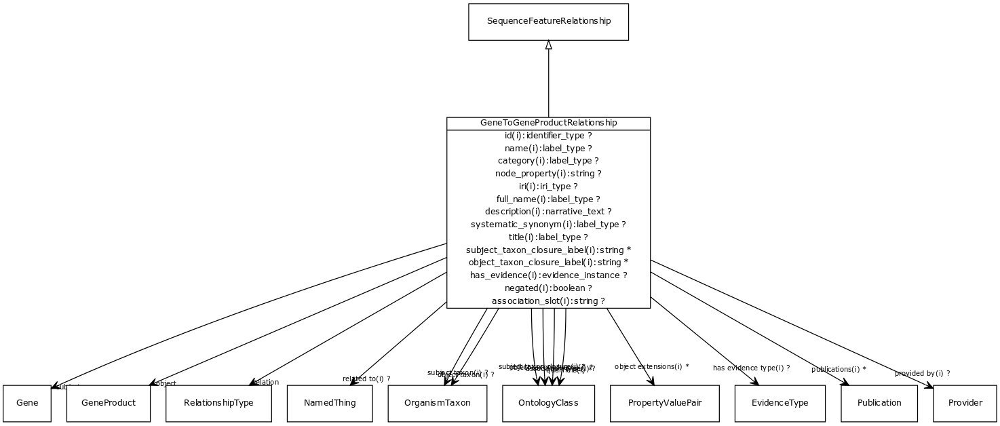

# Class: gene to gene product relationship

A gene is transcribed and potentially translated to a gene product

URI: [http://bioentity.io/vocab/GeneToGeneProductRelationship](http://bioentity.io/vocab/GeneToGeneProductRelationship)

## Mappings

## Inheritance

 *  is_a: [SequenceFeatureRelationship](SequenceFeatureRelationship.md) - For example, a particular exon is part of a particular transcript or gene
## Children

## Used in

## Fields

 * _[gene to gene product relationship.object](gene_to_gene_product_relationship_object.md)_
    * _connects an association to the object of the association. For example, in a gene-to-phenotype association, the gene is subject and phenotype is object._
    * range: [GeneProduct](GeneProduct.md) [required]
    * __Local__
 * _[gene to gene product relationship.relation](gene_to_gene_product_relationship_relation.md)_
    * _the relationship type by which a subject is connected to an object in an association_
    * range: [RelationshipType](RelationshipType.md) [required]
    * edge label: [has gene product](has_gene_product.md) *subsets*: (translator_minimal)
    * __Local__
 * _[gene to gene product relationship.subject](gene_to_gene_product_relationship_subject.md)_
    * _connects an association to the subject of the association. For example, in a gene-to-phenotype association, the gene is subject and phenotype is object._
    * range: [Gene](Gene.md) [required]
    * __Local__
 * _[association slot](association_slot.md)_
    * _any slot that relates an association to another entity_
    * range: **string**
    * inherited from: [Association](Association.md)
 * _[association type](association_type.md)_
    * _connects an association to the type of association (e.g. gene to phenotype)_
    * range: [OntologyClass](OntologyClass.md)
    * inherited from: [Association](Association.md)
 * _[category](category.md) *subsets*: (translator_minimal)_
    * _Name of the high level ontology class in which this entity is categorized. Corresponds to the label for the biolink entity type class. In a neo4j database this MAY correspond to the neo4j label tag_
    * range: [LabelType](LabelType.md)
    * inherited from: [NamedThing](NamedThing.md)
 * _[description](description.md) *subsets*: (translator_minimal)_
    * _a human-readable description of a thing_
    * range: [NarrativeText](NarrativeText.md)
    * inherited from: [NamedThing](NamedThing.md)
 * _[full name](full_name.md)_
    * _a long-form human readable name for a thing_
    * range: [LabelType](LabelType.md)
    * inherited from: [NamedThing](NamedThing.md)
 * _[has evidence](has_evidence.md)_
    * _connects an association to an instance of supporting evidence_
    * range: [EvidenceInstance](EvidenceInstance.md)
    * inherited from: [ExtensionsAndEvidenceAssociationMixin](ExtensionsAndEvidenceAssociationMixin.md)
 * _[has evidence type](has_evidence_type.md)_
    * _connects an association to the class of evidence used_
    * range: [EvidenceType](EvidenceType.md)
    * inherited from: [ExtensionsAndEvidenceAssociationMixin](ExtensionsAndEvidenceAssociationMixin.md)
 * _[id](id.md) *subsets*: (translator_minimal)_
    * _A unique identifier for a thing. Must be either a CURIE shorthand for a URI or a complete URI_
    * range: [IdentifierType](IdentifierType.md)
    * inherited from: [NamedThing](NamedThing.md)
 * _[iri](iri.md) *subsets*: (translator_minimal)_
    * _An IRI for the node. This is determined by the id using expansion rules._
    * range: [IriType](IriType.md)
    * inherited from: [NamedThing](NamedThing.md)
 * _[name](name.md) *subsets*: (translator_minimal)_
    * _A human-readable name for a thing_
    * range: [LabelType](LabelType.md)
    * inherited from: [NamedThing](NamedThing.md)
 * _[negated](negated.md)_
    * _if set to true, then the association is negated i.e. is not true_
    * range: **boolean**
    * inherited from: [Association](Association.md)
 * _[node property](node_property.md)_
    * _A grouping for any property that holds between a node and a value_
    * range: **string**
    * inherited from: [NamedThing](NamedThing.md)
 * _[object extensions](object_extensions.md)_
    * _Additional relationships that are true of the object in the context of the association. For example, if the object is an anatomical term in an expression association, the object extensions may include part-of links_
    * range: [PropertyValuePair](PropertyValuePair.md)*
    * inherited from: [ExtensionsAndEvidenceAssociationMixin](ExtensionsAndEvidenceAssociationMixin.md)
 * _[object taxon](object_taxon.md)_
    * _the taxonomic class of the entity in the object slot_
    * range: [OrganismTaxon](OrganismTaxon.md)
    * inherited from: [TaxonClosureMixin](TaxonClosureMixin.md)
 * _[object taxon closure](object_taxon_closure.md)_
    * _The taxon class or ancestor class for the object_
    * range: [OntologyClass](OntologyClass.md)*
    * inherited from: [TaxonClosureMixin](TaxonClosureMixin.md)
 * _[object taxon closure label](object_taxon_closure_label.md)_
    * _The label for the taxon class or ancestor class for the object_
    * range: **string***
    * inherited from: [TaxonClosureMixin](TaxonClosureMixin.md)
 * _[object taxon label](object_taxon_label.md)_
    * range: label
    * inherited from: [TaxonClosureMixin](TaxonClosureMixin.md)
 * _[provided by](provided_by.md)_
    * _connects an association to the agent (person, organization or group) that provided it_
    * range: [Provider](Provider.md)
    * inherited from: [Association](Association.md)
 * _[publications](publications.md)_
    * _connects an association to publications supporting the association_
    * range: [Publication](Publication.md)*
    * inherited from: [Association](Association.md)
 * _[qualifiers](qualifiers.md)_
    * _connects an association to qualifiers that modify or qualify the meaning of that association_
    * range: [OntologyClass](OntologyClass.md)*
    * inherited from: [Association](Association.md)
 * _[related to](related_to.md)_
    * _A grouping for any relationship type that holds between any two things_
    * range: [NamedThing](NamedThing.md)
    * inherited from: [NamedThing](NamedThing.md)
 * _[subject taxon](subject_taxon.md)_
    * _the taxonomic class of the entity in the object slot_
    * range: [OrganismTaxon](OrganismTaxon.md)
    * inherited from: [TaxonClosureMixin](TaxonClosureMixin.md)
 * _[subject taxon closure](subject_taxon_closure.md)_
    * _The taxon class or ancestor class for the subject_
    * range: [OntologyClass](OntologyClass.md)*
    * inherited from: [TaxonClosureMixin](TaxonClosureMixin.md)
 * _[subject taxon closure label](subject_taxon_closure_label.md)_
    * _The label for the taxon class or ancestor class for the subject_
    * range: **string***
    * inherited from: [TaxonClosureMixin](TaxonClosureMixin.md)
 * _[subject taxon label](subject_taxon_label.md)_
    * range: label
    * inherited from: [TaxonClosureMixin](TaxonClosureMixin.md)
 * _[systematic synonym](systematic_synonym.md)_
    * _more commonly used for gene symbols in yeast_
    * range: [LabelType](LabelType.md)
    * inherited from: [NamedThing](NamedThing.md)
 * _[title](title.md)_
    * _Narrative text describing the entity_
    * range: [LabelType](LabelType.md)
    * inherited from: [InformationContentEntity](InformationContentEntity.md)
