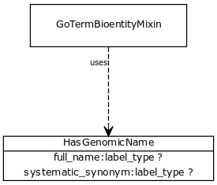

# Class: has genomic name

mixing class for any entity that has a full name and a systematic synonym

URI: [http://bioentity.io/vocab/HasGenomicName](http://bioentity.io/vocab/HasGenomicName)

## Mappings

## Inheritance

## Children

 * [GoTermBioentityMixin](GoTermBioentityMixin.md) (mixin)  - mixes in GO properties to bio-entities
## Used in

## Fields

 * _[full name](full_name.md)_
    * _a long-form human readable name for a thing_
    * range: [LabelType](LabelType.md)
    * __Local__
 * _[systematic synonym](systematic_synonym.md)_
    * _more commonly used for gene symbols in yeast_
    * range: [LabelType](LabelType.md)
    * __Local__
