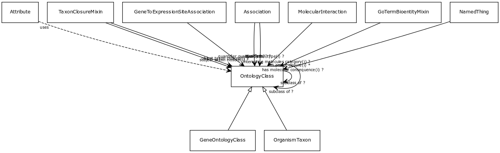

# Class: ontology class

a concept or class in an ontology, vocabulary or thesaurus

URI: [http://bioentity.io/vocab/OntologyClass](http://bioentity.io/vocab/OntologyClass)

## Mappings

## Inheritance

## Children

 * [GeneOntologyClass](GeneOntologyClass.md) - an ontology class that describes a functional aspect of a gene, gene prodoct or complex
 * [OrganismTaxon](OrganismTaxon.md)
 * [Attribute](Attribute.md) (mixin)  - A property or characteristic of an entity
## Used in

 *  class: **[Association](Association.md)** *[association type](association_type.md)* **[OntologyClass](OntologyClass.md)**
 *  class: **None** *[closure concept slot](closure_concept_slot.md)* **[OntologyClass](OntologyClass.md)**
 *  class: **[NamedThing](NamedThing.md)** *[has molecular consequence](has_molecular_consequence.md)* **[OntologyClass](OntologyClass.md)**
 *  class: **[GoTermBioentityMixin](GoTermBioentityMixin.md)** *[isa partof closure](isa_partof_closure.md)* **[OntologyClass](OntologyClass.md)**
 *  class: **[MolecularInteraction](MolecularInteraction.md)** *[molecular interaction.interacting molecules category](molecular_interaction_interacting_molecules_category.md)* **[OntologyClass](OntologyClass.md)**
 *  class: **[TaxonClosureMixin](TaxonClosureMixin.md)** *[object taxon closure](object_taxon_closure.md)* **[OntologyClass](OntologyClass.md)**
 *  class: **[Association](Association.md)** *[qualifiers](qualifiers.md)* **[OntologyClass](OntologyClass.md)**
 *  class: **[GeneToExpressionSiteAssociation](GeneToExpressionSiteAssociation.md)** *[quantifier qualifier](quantifier_qualifier.md)* **[OntologyClass](OntologyClass.md)**
 *  class: **[OntologyClass](OntologyClass.md)** *[subclass of](subclass_of.md)* **[OntologyClass](OntologyClass.md)**
 *  class: **[TaxonClosureMixin](TaxonClosureMixin.md)** *[subject taxon closure](subject_taxon_closure.md)* **[OntologyClass](OntologyClass.md)**
## Fields

 * _[subclass of](subclass_of.md) *subsets*: (translator_minimal)_
    * _holds between two classes where the domain class is a specialization of the range class_
    * range: [OntologyClass](OntologyClass.md)
    * __Local__
