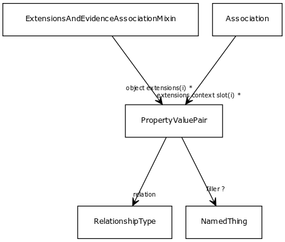

# Class: property value pair

URI: [http://bioentity.io/vocab/PropertyValuePair](http://bioentity.io/vocab/PropertyValuePair)

## Mappings

## Inheritance

## Children

## Used in

 *  class: **[Association](Association.md)** *[extensions context slot](extensions_context_slot.md)* **[PropertyValuePair](PropertyValuePair.md)**
 *  class: **[ExtensionsAndEvidenceAssociationMixin](ExtensionsAndEvidenceAssociationMixin.md)** *[object extensions](object_extensions.md)* **[PropertyValuePair](PropertyValuePair.md)**
## Fields

 * _[filler](filler.md)_
    * _The value in a property-value tuple_
    * range: [NamedThing](NamedThing.md)
    * __Local__
 * _[relation](relation.md)_
    * _the relationship type by which a subject is connected to an object in an association_
    * range: [RelationshipType](RelationshipType.md) [required]
    * __Local__
