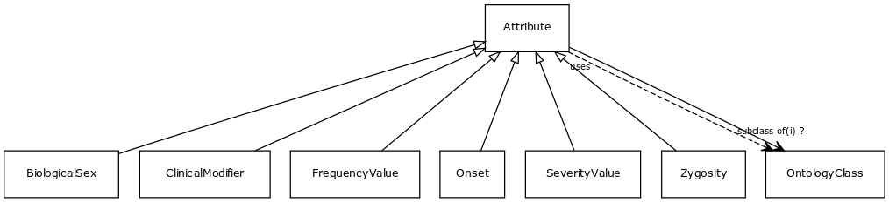

# Class: attribute

A property or characteristic of an entity

URI: [http://bioentity.io/vocab/Attribute](http://bioentity.io/vocab/Attribute)

## Mappings

 * [PATO:0000001](http://purl.obolibrary.org/obo/PATO_0000001)
## Inheritance

 *  mixin: [OntologyClass](OntologyClass.md) - a concept or class in an ontology, vocabulary or thesaurus
## Children

 * [BiologicalSex](BiologicalSex.md)
 * [ClinicalModifier](ClinicalModifier.md) - Used to characterize and specify the phenotypic abnormalities defined in the Phenotypic abnormality subontology, with respect to severity, laterality, age of onset, and other aspects
 * [FrequencyValue](FrequencyValue.md) - describes the frequency of occurrence of an event or condition
 * [Onset](Onset.md) - The age group in which manifestations appear
 * [SeverityValue](SeverityValue.md) - describes the severity of a phenotypic feature or disease
 * [Zygosity](Zygosity.md)
## Used in

## Fields

 * _[subclass of](subclass_of.md) *subsets*: (translator_minimal)_
    * _holds between two classes where the domain class is a specialization of the range class_
    * range: [OntologyClass](OntologyClass.md)
    * inherited from: [OntologyClass](OntologyClass.md)
