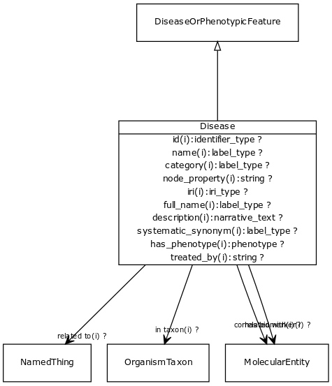

# Class: disease

URI: [http://bioentity.io/vocab/Disease](http://bioentity.io/vocab/Disease)

## Mappings

 * [MONDO:0000001](http://purl.obolibrary.org/obo/MONDO_0000001)
 * [WD:Q12136](http://purl.obolibrary.org/obo/WD_Q12136)
 * [SIO:010299](http://semanticscience.org/resource/SIO_010299)
 * [UMLSSG:DISO](http://purl.obolibrary.org/obo/UMLSSG_DISO)
## Inheritance

 *  is_a: [DiseaseOrPhenotypicFeature](DiseaseOrPhenotypicFeature.md) - Either one of a disease or an individual phenotypic feature. Some knowledge resources such as Monarch treat these as distinct, others such as MESH conflate.
## Children

## Used in

 *  class: **[DiseaseToThingAssociation](DiseaseToThingAssociation.md)** *[disease to thing association.subject](disease_to_thing_association_subject.md)* **[Disease](Disease.md)**
 *  class: **[EntityToDiseaseAssociation](EntityToDiseaseAssociation.md)** *[entity to disease association.object](entity_to_disease_association_object.md)* **[Disease](Disease.md)**
 *  class: **[NamedThing](NamedThing.md)** *[manifestation of](manifestation_of.md)* **[Disease](Disease.md)**
## Fields

 * _[category](category.md) *subsets*: (translator_minimal)_
    * _Name of the high level ontology class in which this entity is categorized. Corresponds to the label for the biolink entity type class. In a neo4j database this MAY correspond to the neo4j label tag_
    * range: [LabelType](LabelType.md)
    * inherited from: [NamedThing](NamedThing.md)
 * _[correlated with](correlated_with.md) *subsets*: (translator_minimal)_
    * _holds between a disease or phenotypic feature and a measurable molecular entity that is used as an indicator of the presence or state of the disease or feature._
    * range: [MolecularEntity](MolecularEntity.md)
    * inherited from: [DiseaseOrPhenotypicFeature](DiseaseOrPhenotypicFeature.md)
 * _[description](description.md) *subsets*: (translator_minimal)_
    * _a human-readable description of a thing_
    * range: [NarrativeText](NarrativeText.md)
    * inherited from: [NamedThing](NamedThing.md)
 * _[full name](full_name.md)_
    * _a long-form human readable name for a thing_
    * range: [LabelType](LabelType.md)
    * inherited from: [NamedThing](NamedThing.md)
 * _[has alternate identifier](has_alternate_identifier.md)_
    * _An alternate identifier for the entity, provided by the source database_
    * range: [IdentifierType](IdentifierType.md)*
    * inherited from: [NamedThing](NamedThing.md)
 * _[has biomarker](has_biomarker.md) *subsets*: (translator_minimal)_
    * _holds between a disease or phenotypic feature and a measurable molecular entity that is used as an indicator of the presence or state of the disease or feature._
    * range: [MolecularEntity](MolecularEntity.md)
    * inherited from: [DiseaseOrPhenotypicFeature](DiseaseOrPhenotypicFeature.md)
 * _[has phenotype](has_phenotype.md) *subsets*: (translator_minimal)_
    * _holds between a biological entity and a phenotype, where a phenotype is construed broadly as any kind of quality of an organism part, a collection of these qualities, or a change in quality or qualities (e.g. abnormally increased temperature). _
    * range: [Phenotype](Phenotype.md)
    * inherited from: [BiologicalEntity](BiologicalEntity.md)
 * _[has synonym](has_synonym.md)_
    * _Alternate labels for an entity_
    * range: [LabelType](LabelType.md)*
    * inherited from: [NamedThing](NamedThing.md)
 * _[has xref](has_xref.md)_
    * _A database cross-reference for the entity, provided by a separate database_
    * range: [IdentifierType](IdentifierType.md)*
    * inherited from: [NamedThing](NamedThing.md)
 * _[id](id.md) *subsets*: (translator_minimal)_
    * _A unique identifier for a thing. Must be either a CURIE shorthand for a URI or a complete URI_
    * range: [IdentifierType](IdentifierType.md)
    * inherited from: [NamedThing](NamedThing.md)
 * _[in taxon](in_taxon.md) *subsets*: (translator_minimal)_
    * _connects a thing to a class representing a taxon_
    * range: [OrganismTaxon](OrganismTaxon.md)
    * inherited from: [ThingWithTaxon](ThingWithTaxon.md)
 * _[iri](iri.md) *subsets*: (translator_minimal)_
    * _An IRI for the node. This is determined by the id using expansion rules._
    * range: [IriType](IriType.md)
    * inherited from: [NamedThing](NamedThing.md)
 * _[name](name.md) *subsets*: (translator_minimal)_
    * _A human-readable name for a thing_
    * range: [LabelType](LabelType.md)
    * inherited from: [NamedThing](NamedThing.md)
 * _[node property](node_property.md)_
    * _A grouping for any property that holds between a node and a value_
    * range: **string**
    * inherited from: [NamedThing](NamedThing.md)
 * _[related to](related_to.md)_
    * _A grouping for any relationship type that holds between any two things_
    * range: [NamedThing](NamedThing.md)
    * inherited from: [NamedThing](NamedThing.md)
 * _[systematic synonym](systematic_synonym.md)_
    * _more commonly used for gene symbols in yeast_
    * range: [LabelType](LabelType.md)
    * inherited from: [NamedThing](NamedThing.md)
 * _[treated by](treated_by.md) *subsets*: (translator_minimal)_
    * _holds between a disease or phenotypic feature and a therapeutic process or chemical substance that is used to treat the condition _
    * range: **string**
    * inherited from: [DiseaseOrPhenotypicFeature](DiseaseOrPhenotypicFeature.md)
