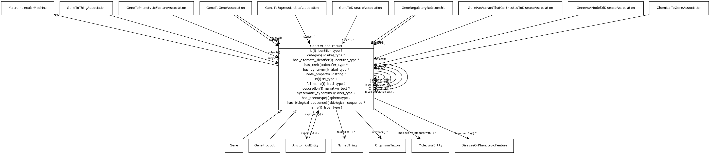

# Class: gene or gene product

a union of genes or gene products. Frequently an identifier for one will be used as proxy for another

URI: [http://bioentity.io/vocab/GeneOrGeneProduct](http://bioentity.io/vocab/GeneOrGeneProduct)

## Mappings

## Inheritance

 *  is_a: [MacromolecularMachine](MacromolecularMachine.md) - A union of gene, gene product, and macromolecular complex. These are the basic units of function in a cell. They either carry out individual biological activities, or they encode molecules which do this.
## Children

 * [Gene](Gene.md)
 * [GeneProduct](GeneProduct.md) - The functional molecular product of a single gene. Gene products are either proteins or functional RNA molecules
## Used in

 *  class: **[ChemicalToGeneAssociation](ChemicalToGeneAssociation.md)** *[chemical to gene association.object](chemical_to_gene_association_object.md)* **[GeneOrGeneProduct](GeneOrGeneProduct.md)**
 *  class: **[AnatomicalEntity](AnatomicalEntity.md)** *[expresses](expresses.md)* **[GeneOrGeneProduct](GeneOrGeneProduct.md)**
 *  class: **[GeneAsAModelOfDiseaseAssociation](GeneAsAModelOfDiseaseAssociation.md)** *[gene as a model of disease association.subject](gene_as_a_model_of_disease_association_subject.md)* **[GeneOrGeneProduct](GeneOrGeneProduct.md)**
 *  class: **[GeneHasVariantThatContributesToDiseaseAssociation](GeneHasVariantThatContributesToDiseaseAssociation.md)** *[gene has variant that contributes to disease association.subject](gene_has_variant_that_contributes_to_disease_association_subject.md)* **[GeneOrGeneProduct](GeneOrGeneProduct.md)**
 *  class: **[GeneRegulatoryRelationship](GeneRegulatoryRelationship.md)** *[gene regulatory relationship.object](gene_regulatory_relationship_object.md)* **[GeneOrGeneProduct](GeneOrGeneProduct.md)**
 *  class: **[GeneRegulatoryRelationship](GeneRegulatoryRelationship.md)** *[gene regulatory relationship.subject](gene_regulatory_relationship_subject.md)* **[GeneOrGeneProduct](GeneOrGeneProduct.md)**
 *  class: **[GeneToDiseaseAssociation](GeneToDiseaseAssociation.md)** *[gene to disease association.subject](gene_to_disease_association_subject.md)* **[GeneOrGeneProduct](GeneOrGeneProduct.md)**
 *  class: **[GeneToExpressionSiteAssociation](GeneToExpressionSiteAssociation.md)** *[gene to expression site association.subject](gene_to_expression_site_association_subject.md)* **[GeneOrGeneProduct](GeneOrGeneProduct.md)**
 *  class: **[GeneToGeneAssociation](GeneToGeneAssociation.md)** *[gene to gene association.object](gene_to_gene_association_object.md)* **[GeneOrGeneProduct](GeneOrGeneProduct.md)**
 *  class: **[GeneToGeneAssociation](GeneToGeneAssociation.md)** *[gene to gene association.subject](gene_to_gene_association_subject.md)* **[GeneOrGeneProduct](GeneOrGeneProduct.md)**
 *  class: **[GeneToPhenotypicFeatureAssociation](GeneToPhenotypicFeatureAssociation.md)** *[gene to phenotypic feature association.subject](gene_to_phenotypic_feature_association_subject.md)* **[GeneOrGeneProduct](GeneOrGeneProduct.md)**
 *  class: **[GeneToThingAssociation](GeneToThingAssociation.md)** *[gene to thing association.subject](gene_to_thing_association_subject.md)* **[GeneOrGeneProduct](GeneOrGeneProduct.md)**
 *  class: **[GeneOrGeneProduct](GeneOrGeneProduct.md)** *[in cell population with](in_cell_population_with.md)* **[GeneOrGeneProduct](GeneOrGeneProduct.md)**
 *  class: **[GeneOrGeneProduct](GeneOrGeneProduct.md)** *[in complex with](in_complex_with.md)* **[GeneOrGeneProduct](GeneOrGeneProduct.md)**
 *  class: **[GeneOrGeneProduct](GeneOrGeneProduct.md)** *[in pathway with](in_pathway_with.md)* **[GeneOrGeneProduct](GeneOrGeneProduct.md)**
## Fields

 * _[expressed in](expressed_in.md) *subsets*: (translator_minimal)_
    * _holds between a gene or gene product and an anatomical entity in which it is expressed_
    * range: [AnatomicalEntity](AnatomicalEntity.md)
    * __Local__
 * _[in cell population with](in_cell_population_with.md) *subsets*: (translator_minimal)_
    * _holds between two genes or gene products that are expressed in the same cell type or population _
    * range: [GeneOrGeneProduct](GeneOrGeneProduct.md)
    * __Local__
 * _[in complex with](in_complex_with.md) *subsets*: (translator_minimal)_
    * _holds between two genes or gene products that are part of (or code for products that are part of) in the same macromolecular complex_
    * range: [GeneOrGeneProduct](GeneOrGeneProduct.md)
    * __Local__
 * _[in pathway with](in_pathway_with.md) *subsets*: (translator_minimal)_
    * _holds between two genes or gene products that are part of in the same biological pathway_
    * range: [GeneOrGeneProduct](GeneOrGeneProduct.md)
    * __Local__
 * _[biomarker for](biomarker_for.md) *subsets*: (translator_minimal)_
    * _holds between a measurable molecular entity and a disease or phenotypic feature, where the entity is used as an indicator of the presence or state of the disease or feature._
    * range: [DiseaseOrPhenotypicFeature](DiseaseOrPhenotypicFeature.md)
    * inherited from: [MolecularEntity](MolecularEntity.md)
 * _[category](category.md) *subsets*: (translator_minimal)_
    * _Name of the high level ontology class in which this entity is categorized. Corresponds to the label for the biolink entity type class. In a neo4j database this MAY correspond to the neo4j label tag_
    * range: [LabelType](LabelType.md)
    * inherited from: [NamedThing](NamedThing.md)
 * _[description](description.md) *subsets*: (translator_minimal)_
    * _a human-readable description of a thing_
    * range: [NarrativeText](NarrativeText.md)
    * inherited from: [NamedThing](NamedThing.md)
 * _[full name](full_name.md)_
    * _a long-form human readable name for a thing_
    * range: [LabelType](LabelType.md)
    * inherited from: [NamedThing](NamedThing.md)
 * _[has alternate identifier](has_alternate_identifier.md)_
    * _An alternate identifier for the entity, provided by the source database_
    * range: [IdentifierType](IdentifierType.md)*
    * inherited from: [NamedThing](NamedThing.md)
 * _[has biological sequence](has_biological_sequence.md)_
    * _connects a genomic feature to its sequence_
    * range: [BiologicalSequence](BiologicalSequence.md)
    * inherited from: [GenomicEntity](GenomicEntity.md)
 * _[has phenotype](has_phenotype.md) *subsets*: (translator_minimal)_
    * _holds between a biological entity and a phenotype, where a phenotype is construed broadly as any kind of quality of an organism part, a collection of these qualities, or a change in quality or qualities (e.g. abnormally increased temperature). _
    * range: [Phenotype](Phenotype.md)
    * inherited from: [BiologicalEntity](BiologicalEntity.md)
 * _[has synonym](has_synonym.md)_
    * _Alternate labels for an entity_
    * range: [LabelType](LabelType.md)*
    * inherited from: [NamedThing](NamedThing.md)
 * _[has xref](has_xref.md)_
    * _A database cross-reference for the entity, provided by a separate database_
    * range: [IdentifierType](IdentifierType.md)*
    * inherited from: [NamedThing](NamedThing.md)
 * _[id](id.md) *subsets*: (translator_minimal)_
    * _A unique identifier for a thing. Must be either a CURIE shorthand for a URI or a complete URI_
    * range: [IdentifierType](IdentifierType.md)
    * inherited from: [NamedThing](NamedThing.md)
 * _[in taxon](in_taxon.md) *subsets*: (translator_minimal)_
    * _connects a thing to a class representing a taxon_
    * range: [OrganismTaxon](OrganismTaxon.md)
    * inherited from: [ThingWithTaxon](ThingWithTaxon.md)
 * _[iri](iri.md) *subsets*: (translator_minimal)_
    * _An IRI for the node. This is determined by the id using expansion rules._
    * range: [IriType](IriType.md)
    * inherited from: [NamedThing](NamedThing.md)
 * _[macromolecular machine.name](macromolecular_machine_name.md) *subsets*: (translator_minimal)_
    * _A human-readable name for a thing_
    * range: [LabelType](LabelType.md)
    * inherited from: [MacromolecularMachine](MacromolecularMachine.md)
 * _[molecularly interacts with](molecularly_interacts_with.md) *subsets*: (translator_minimal)_
    * _holds between two entities that make physical contact as part of some interaction_
    * range: [MolecularEntity](MolecularEntity.md)
    * inherited from: [MolecularEntity](MolecularEntity.md)
 * _[node property](node_property.md)_
    * _A grouping for any property that holds between a node and a value_
    * range: **string**
    * inherited from: [NamedThing](NamedThing.md)
 * _[regulates, entity to entity](regulates_entity_to_entity.md) *subsets*: (translator_minimal)_
    * _describes an entity that has a direct affect on the state or quality of another existing entity. Use of the 'affects' predicate implies that the affected entity already exists, unlike predicates such as 'affects risk for' and 'prevents, where the outcome is something that may or may not come to be._
    * range: [MolecularEntity](MolecularEntity.md)
    * inherited from: [MolecularEntity](MolecularEntity.md)
 * _[related to](related_to.md)_
    * _A grouping for any relationship type that holds between any two things_
    * range: [NamedThing](NamedThing.md)
    * inherited from: [NamedThing](NamedThing.md)
 * _[systematic synonym](systematic_synonym.md)_
    * _more commonly used for gene symbols in yeast_
    * range: [LabelType](LabelType.md)
    * inherited from: [NamedThing](NamedThing.md)
