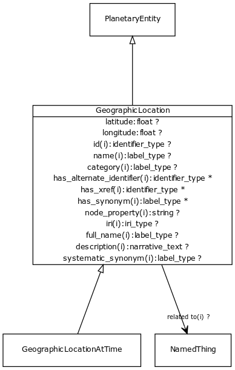

# Class: geographic location

a location that can be described in lat/long coordinates

URI: [http://bioentity.io/vocab/GeographicLocation](http://bioentity.io/vocab/GeographicLocation)

## Mappings

 * [UMLSSG:GEOG](http://purl.obolibrary.org/obo/UMLSSG_GEOG)
## Inheritance

 *  is_a: [PlanetaryEntity](PlanetaryEntity.md) - Any entity or process that exists at the level of the whole planet
## Children

 * [GeographicLocationAtTime](GeographicLocationAtTime.md) - a location that can be described in lat/long coordinates, for a particular time
## Used in

## Fields

 * _[latitude](latitude.md)_
    * _latitude_
    * range: **float**
    * __Local__
 * _[longitude](longitude.md)_
    * _longitude_
    * range: **float**
    * __Local__
 * _[category](category.md) *subsets*: (translator_minimal)_
    * _Name of the high level ontology class in which this entity is categorized. Corresponds to the label for the biolink entity type class. In a neo4j database this MAY correspond to the neo4j label tag_
    * range: [LabelType](LabelType.md)
    * inherited from: [NamedThing](NamedThing.md)
 * _[description](description.md) *subsets*: (translator_minimal)_
    * _a human-readable description of a thing_
    * range: [NarrativeText](NarrativeText.md)
    * inherited from: [NamedThing](NamedThing.md)
 * _[full name](full_name.md)_
    * _a long-form human readable name for a thing_
    * range: [LabelType](LabelType.md)
    * inherited from: [NamedThing](NamedThing.md)
 * _[has alternate identifier](has_alternate_identifier.md)_
    * _An alternate identifier for the entity, provided by the source database_
    * range: identifier*
    * inherited from: [NamedThing](NamedThing.md)
 * _[has synonym](has_synonym.md)_
    * _Alternate labels for an entity_
    * range: [name](name.md) *subsets*: (translator_minimal)*
    * inherited from: [NamedThing](NamedThing.md)
 * _[has xref](has_xref.md)_
    * _A database cross-reference for the entity, provided by a separate database_
    * range: identifier*
    * inherited from: [NamedThing](NamedThing.md)
 * _[id](id.md) *subsets*: (translator_minimal)_
    * _A unique identifier for a thing. Must be either a CURIE shorthand for a URI or a complete URI_
    * range: [IdentifierType](IdentifierType.md)
    * inherited from: [NamedThing](NamedThing.md)
 * _[iri](iri.md) *subsets*: (translator_minimal)_
    * _An IRI for the node. This is determined by the id using expansion rules._
    * range: [IriType](IriType.md)
    * inherited from: [NamedThing](NamedThing.md)
 * _[name](name.md) *subsets*: (translator_minimal)_
    * _A human-readable name for a thing_
    * range: [LabelType](LabelType.md)
    * inherited from: [NamedThing](NamedThing.md)
 * _[node property](node_property.md)_
    * _A grouping for any property that holds between a node and a value_
    * range: **string**
    * inherited from: [NamedThing](NamedThing.md)
 * _[related to](related_to.md)_
    * _A grouping for any relationship type that holds between any two things_
    * range: [NamedThing](NamedThing.md)
    * inherited from: [NamedThing](NamedThing.md)
 * _[systematic synonym](systematic_synonym.md)_
    * _more commonly used for gene symbols in yeast_
    * range: [LabelType](LabelType.md)
    * inherited from: [NamedThing](NamedThing.md)
