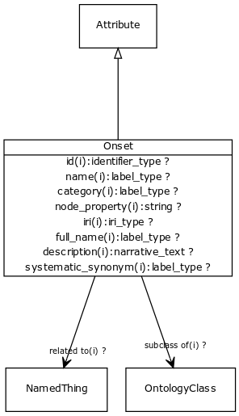

# Class: onset

The age group in which manifestations appear

URI: [http://bioentity.io/vocab/Onset](http://bioentity.io/vocab/Onset)

## Mappings

 * [HP:0003674](http://purl.obolibrary.org/obo/HP_0003674)
## Inheritance

 *  is_a: [Attribute](Attribute.md) - A property or characteristic of an entity
## Children

## Used in

 *  class: **[EntityToFeatureOrDiseaseQualifiers](EntityToFeatureOrDiseaseQualifiers.md)** *[onset qualifier](onset_qualifier.md)* **[Onset](Onset.md)**
## Fields

 * _[subclass of](subclass_of.md) *subsets*: (translator_minimal)_
    * _holds between two classes where the domain class is a specialization of the range class_
    * range: [OntologyClass](OntologyClass.md)
    * inherited from: [OntologyClass](OntologyClass.md)
