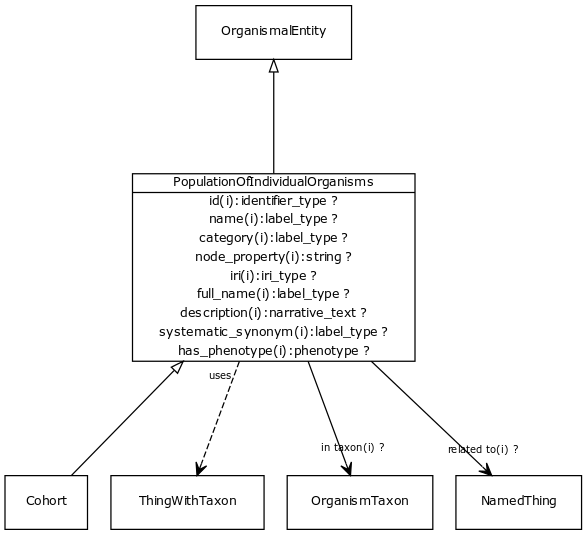

# Class: population of individual organisms

URI: [http://bioentity.io/vocab/PopulationOfIndividualOrganisms](http://bioentity.io/vocab/PopulationOfIndividualOrganisms)

## Mappings

 * [SIO:001061](http://semanticscience.org/resource/SIO_001061)
 * [PCO:0000001](http://purl.obolibrary.org/obo/PCO_0000001)
## Inheritance

 *  is_a: [OrganismalEntity](OrganismalEntity.md) - A named entity that is either a part of an organism, a whole organism, population or clade of organisms, excluding molecular entities
 *  mixin: [ThingWithTaxon](ThingWithTaxon.md) - A mixin that can be used on any entity with a taxon
## Children

 * [Cohort](Cohort.md)
## Used in

 *  class: **[PopulationToPopulationAssociation](PopulationToPopulationAssociation.md)** *[population to population association.object](population_to_population_association_object.md)* **[PopulationOfIndividualOrganisms](PopulationOfIndividualOrganisms.md)**
 *  class: **[PopulationToPopulationAssociation](PopulationToPopulationAssociation.md)** *[population to population association.subject](population_to_population_association_subject.md)* **[PopulationOfIndividualOrganisms](PopulationOfIndividualOrganisms.md)**
 *  class: **[VariantToPopulationAssociation](VariantToPopulationAssociation.md)** *[variant to population association.object](variant_to_population_association_object.md)* **[PopulationOfIndividualOrganisms](PopulationOfIndividualOrganisms.md)**
## Fields

 * _[category](category.md) *subsets*: (translator_minimal)_
    * _Name of the high level ontology class in which this entity is categorized. Corresponds to the label for the biolink entity type class. In a neo4j database this MAY correspond to the neo4j label tag_
    * range: [LabelType](LabelType.md)
    * inherited from: [NamedThing](NamedThing.md)
 * _[description](description.md) *subsets*: (translator_minimal)_
    * _a human-readable description of a thing_
    * range: [NarrativeText](NarrativeText.md)
    * inherited from: [NamedThing](NamedThing.md)
 * _[full name](full_name.md)_
    * _a long-form human readable name for a thing_
    * range: [LabelType](LabelType.md)
    * inherited from: [NamedThing](NamedThing.md)
 * _[has alternate identifier](has_alternate_identifier.md)_
    * _An alternate identifier for the entity, provided by the source database_
    * range: [IdentifierType](IdentifierType.md)*
    * inherited from: [NamedThing](NamedThing.md)
 * _[has phenotype](has_phenotype.md) *subsets*: (translator_minimal)_
    * _holds between a biological entity and a phenotype, where a phenotype is construed broadly as any kind of quality of an organism part, a collection of these qualities, or a change in quality or qualities (e.g. abnormally increased temperature). _
    * range: [Phenotype](Phenotype.md)
    * inherited from: [BiologicalEntity](BiologicalEntity.md)
 * _[has synonym](has_synonym.md)_
    * _Alternate labels for an entity_
    * range: [LabelType](LabelType.md)*
    * inherited from: [NamedThing](NamedThing.md)
 * _[has xref](has_xref.md)_
    * _A database cross-reference for the entity, provided by a separate database_
    * range: [IdentifierType](IdentifierType.md)*
    * inherited from: [NamedThing](NamedThing.md)
 * _[id](id.md) *subsets*: (translator_minimal)_
    * _A unique identifier for a thing. Must be either a CURIE shorthand for a URI or a complete URI_
    * range: [IdentifierType](IdentifierType.md)
    * inherited from: [NamedThing](NamedThing.md)
 * _[in taxon](in_taxon.md) *subsets*: (translator_minimal)_
    * _connects a thing to a class representing a taxon_
    * range: [OrganismTaxon](OrganismTaxon.md)
    * inherited from: [ThingWithTaxon](ThingWithTaxon.md)
 * _[iri](iri.md) *subsets*: (translator_minimal)_
    * _An IRI for the node. This is determined by the id using expansion rules._
    * range: [IriType](IriType.md)
    * inherited from: [NamedThing](NamedThing.md)
 * _[name](name.md) *subsets*: (translator_minimal)_
    * _A human-readable name for a thing_
    * range: [LabelType](LabelType.md)
    * inherited from: [NamedThing](NamedThing.md)
 * _[node property](node_property.md)_
    * _A grouping for any property that holds between a node and a value_
    * range: **string**
    * inherited from: [NamedThing](NamedThing.md)
 * _[related to](related_to.md)_
    * _A grouping for any relationship type that holds between any two things_
    * range: [NamedThing](NamedThing.md)
    * inherited from: [NamedThing](NamedThing.md)
 * _[systematic synonym](systematic_synonym.md)_
    * _more commonly used for gene symbols in yeast_
    * range: [LabelType](LabelType.md)
    * inherited from: [NamedThing](NamedThing.md)
