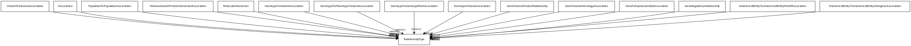

# Class: relationship type

An OWL property used as an edge label

URI: [http://bioentity.io/vocab/RelationshipType](http://bioentity.io/vocab/RelationshipType)

## Mappings

## Inheritance

## Children

## Used in

 *  class: **[AnatomicalEntityToAnatomicalEntityOntogenicAssociation](AnatomicalEntityToAnatomicalEntityOntogenicAssociation.md)** *[anatomical entity to anatomical entity ontogenic association.relation](anatomical_entity_to_anatomical_entity_ontogenic_association_relation.md)* **[RelationshipType](RelationshipType.md)**
 *  class: **[AnatomicalEntityToAnatomicalEntityPartOfAssociation](AnatomicalEntityToAnatomicalEntityPartOfAssociation.md)** *[anatomical entity to anatomical entity part of association.relation](anatomical_entity_to_anatomical_entity_part_of_association_relation.md)* **[RelationshipType](RelationshipType.md)**
 *  class: **[GeneRegulatoryRelationship](GeneRegulatoryRelationship.md)** *[gene regulatory relationship.relation](gene_regulatory_relationship_relation.md)* **[RelationshipType](RelationshipType.md)**
 *  class: **[GeneToExpressionSiteAssociation](GeneToExpressionSiteAssociation.md)** *[gene to expression site association.relation](gene_to_expression_site_association_relation.md)* **[RelationshipType](RelationshipType.md)**
 *  class: **[GeneToGeneHomologyAssociation](GeneToGeneHomologyAssociation.md)** *[gene to gene homology association.relation](gene_to_gene_homology_association_relation.md)* **[RelationshipType](RelationshipType.md)**
 *  class: **[GeneToGeneProductRelationship](GeneToGeneProductRelationship.md)** *[gene to gene product relationship.relation](gene_to_gene_product_relationship_relation.md)* **[RelationshipType](RelationshipType.md)**
 *  class: **[GenotypeToGeneAssociation](GenotypeToGeneAssociation.md)** *[genotype to gene association.relation](genotype_to_gene_association_relation.md)* **[RelationshipType](RelationshipType.md)**
 *  class: **[GenotypeToGenotypePartAssociation](GenotypeToGenotypePartAssociation.md)** *[genotype to genotype part association.relation](genotype_to_genotype_part_association_relation.md)* **[RelationshipType](RelationshipType.md)**
 *  class: **[GenotypeToPhenotypicFeatureAssociation](GenotypeToPhenotypicFeatureAssociation.md)** *[genotype to phenotypic feature association.relation](genotype_to_phenotypic_feature_association_relation.md)* **[RelationshipType](RelationshipType.md)**
 *  class: **[GenotypeToVariantAssociation](GenotypeToVariantAssociation.md)** *[genotype to variant association.relation](genotype_to_variant_association_relation.md)* **[RelationshipType](RelationshipType.md)**
 *  class: **[MolecularInteraction](MolecularInteraction.md)** *[molecular interaction.relation](molecular_interaction_relation.md)* **[RelationshipType](RelationshipType.md)**
 *  class: **[PairwiseGeneOrProteinInteractionAssociation](PairwiseGeneOrProteinInteractionAssociation.md)** *[pairwise gene or protein interaction association.relation](pairwise_gene_or_protein_interaction_association_relation.md)* **[RelationshipType](RelationshipType.md)**
 *  class: **[PopulationToPopulationAssociation](PopulationToPopulationAssociation.md)** *[population to population association.relation](population_to_population_association_relation.md)* **[RelationshipType](RelationshipType.md)**
 *  class: **None** *[regulates closure](regulates_closure.md)* **[RelationshipType](RelationshipType.md)**
 *  class: **[Association](Association.md)** *[relation](relation.md)* **[RelationshipType](RelationshipType.md)**
 *  class: **[VariantToDiseaseAssociation](VariantToDiseaseAssociation.md)** *[variant to disease association.relation](variant_to_disease_association_relation.md)* **[RelationshipType](RelationshipType.md)**
## Fields

