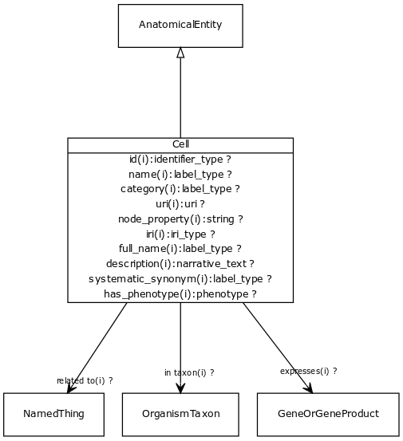

# Class: cell

URI: [http://bioentity.io/vocab/Cell](http://bioentity.io/vocab/Cell)

## Mappings

 * [GO:0005623](http://purl.obolibrary.org/obo/GO_0005623)
 * [CL:0000000](http://purl.obolibrary.org/obo/CL_0000000)
 * [SIO:010001](http://semanticscience.org/resource/SIO_010001)
 * [WD:Q7868](http://purl.obolibrary.org/obo/WD_Q7868)
## Inheritance

 *  is_a: [AnatomicalEntity](AnatomicalEntity.md) - A subcellular location, cell type or gross anatomical part
## Children

## Fields

 * _[category](category.md) *subsets*: (translator_minimal)_
    * _Name of the high level ontology class in which this entity is categorized. Corresponds to the label for the biolink entity type class. In a neo4j database this MAY correspond to the neo4j label tag_
    * range: [LabelType](LabelType.md)
    * inherited from: [NamedThing](NamedThing.md)
 * _[description](description.md) *subsets*: (translator_minimal)_
    * _a human-readable description of a thing_
    * range: [NarrativeText](NarrativeText.md)
    * inherited from: [NamedThing](NamedThing.md)
 * _[expresses](expresses.md) *subsets*: (translator_minimal)_
    * _holds between an anatomical entity and gene or gene product that is expressed there_
    * range: [GeneOrGeneProduct](GeneOrGeneProduct.md)
    * inherited from: [AnatomicalEntity](AnatomicalEntity.md)
 * _[full name](full_name.md)_
    * _a long-form human readable name for a thing_
    * range: [LabelType](LabelType.md)
    * inherited from: [NamedThing](NamedThing.md)
 * _[has phenotype](has_phenotype.md) *subsets*: (translator_minimal)_
    * _holds between a biological entity and a phenotype, where a phenotype is construed broadly as any kind of quality of an organism part, a collection of these qualities, or a change in quality or qualities (e.g. abnormally increased temperature). _
    * range: [Phenotype](Phenotype.md)
    * inherited from: [BiologicalEntity](BiologicalEntity.md)
 * _[id](id.md) *subsets*: (translator_minimal)_
    * _A unique identifier for a thing. Must be either a CURIE shorthand for a URI or a complete URI_
    * range: [IdentifierType](IdentifierType.md)
    * inherited from: [NamedThing](NamedThing.md)
 * _[in taxon](in_taxon.md) *subsets*: (translator_minimal)_
    * _connects a thing to a class representing a taxon_
    * range: [OrganismTaxon](OrganismTaxon.md)
    * inherited from: [ThingWithTaxon](ThingWithTaxon.md)
 * _[iri](iri.md) *subsets*: (translator_minimal)_
    * _An IRI for the node. This is determined by the id using expansion rules._
    * range: [IriType](IriType.md)
    * inherited from: [NamedThing](NamedThing.md)
 * _[name](name.md) *subsets*: (translator_minimal)_
    * _A human-readable name for a thing_
    * range: [LabelType](LabelType.md)
    * inherited from: [NamedThing](NamedThing.md)
 * _[node property](node_property.md)_
    * _A grouping for any property that holds between a node and a value_
    * range: **string**
    * inherited from: [NamedThing](NamedThing.md)
 * _[related to](related_to.md)_
    * _A grouping for any relationship type that holds between any two things_
    * range: [NamedThing](NamedThing.md)
    * inherited from: [NamedThing](NamedThing.md)
 * _[systematic synonym](systematic_synonym.md)_
    * _more commonly used for gene symbols in yeast_
    * range: [LabelType](LabelType.md)
    * inherited from: [NamedThing](NamedThing.md)
 * _[uri](uri.md)_
    * _URI expansion of CURIE_
    * range: [uri](uri.md)
    * inherited from: [NamedThing](NamedThing.md)
