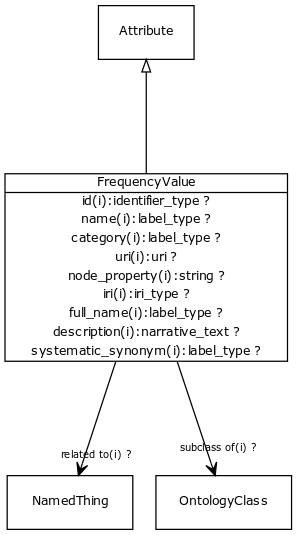

# Class: frequency value

describes the frequency of occurrence of an event or condition

URI: [http://bioentity.io/vocab/FrequencyValue](http://bioentity.io/vocab/FrequencyValue)

## Mappings

## Inheritance

 *  is_a: [Attribute](Attribute.md) - A property or characteristic of an entity
## Children

## Used in

 *  class: **[Association](Association.md)** *[FrequencyQualifier](FrequencyQualifier.md)* **[FrequencyValue](FrequencyValue.md)**
## Fields

 * _[subclass of](subclass_of.md) *subsets*: (translator_minimal)_
    * _holds between two classes where the domain class is a specialization of the range class_
    * range: [OntologyClass](OntologyClass.md)
    * inherited from: [OntologyClass](OntologyClass.md)
