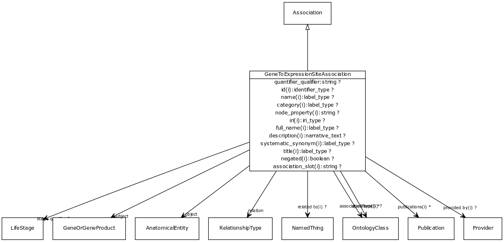

# Class: gene to expression site association

An association between a gene and an expression site, possibly qualified by stage/timing info.

URI: [http://bioentity.io/vocab/GeneToExpressionSiteAssociation](http://bioentity.io/vocab/GeneToExpressionSiteAssociation)

## Mappings

## Inheritance

 *  is_a: [Association](Association.md) - A typed association between two entities, supported by evidence
## Children

## Used in

## Fields

 * _[gene to expression site association.object](gene_to_expression_site_association_object.md)_
    * _connects an association to the object of the association. For example, in a gene-to-phenotype association, the gene is subject and phenotype is object._
    * range: [AnatomicalEntity](AnatomicalEntity.md) [required]
    * __Local__
 * _[gene to expression site association.quantifier qualifier](gene_to_expression_site_association_quantifier_qualifier.md)_
    * _can be used to indicate magnitude, or also ranking_
    * range: **string**
    * __Local__
 * _[gene to expression site association.relation](gene_to_expression_site_association_relation.md)_
    * _the relationship type by which a subject is connected to an object in an association_
    * range: [RelationshipType](RelationshipType.md) [required]
    * edge label: [expressed in](expressed_in.md) *subsets*: (translator_minimal)
    * __Local__
 * _[gene to expression site association.stage qualifier](gene_to_expression_site_association_stage_qualifier.md)_
    * _stage at which the gene is expressed in the site_
    * range: [LifeStage](LifeStage.md)
    * __Local__
 * _[gene to expression site association.subject](gene_to_expression_site_association_subject.md)_
    * _connects an association to the subject of the association. For example, in a gene-to-phenotype association, the gene is subject and phenotype is object._
    * range: [GeneOrGeneProduct](GeneOrGeneProduct.md) [required]
    * __Local__
 * _[association slot](association_slot.md)_
    * _any slot that relates an association to another entity_
    * range: **string**
    * inherited from: [Association](Association.md)
 * _[association type](association_type.md)_
    * _connects an association to the type of association (e.g. gene to phenotype)_
    * range: [OntologyClass](OntologyClass.md)
    * inherited from: [Association](Association.md)
 * _[category](category.md) *subsets*: (translator_minimal)_
    * _Name of the high level ontology class in which this entity is categorized. Corresponds to the label for the biolink entity type class. In a neo4j database this MAY correspond to the neo4j label tag_
    * range: [LabelType](LabelType.md)
    * inherited from: [NamedThing](NamedThing.md)
 * _[description](description.md) *subsets*: (translator_minimal)_
    * _a human-readable description of a thing_
    * range: [NarrativeText](NarrativeText.md)
    * inherited from: [NamedThing](NamedThing.md)
 * _[full name](full_name.md)_
    * _a long-form human readable name for a thing_
    * range: [LabelType](LabelType.md)
    * inherited from: [NamedThing](NamedThing.md)
 * _[id](id.md) *subsets*: (translator_minimal)_
    * _A unique identifier for a thing. Must be either a CURIE shorthand for a URI or a complete URI_
    * range: [IdentifierType](IdentifierType.md)
    * inherited from: [NamedThing](NamedThing.md)
 * _[iri](iri.md) *subsets*: (translator_minimal)_
    * _An IRI for the node. This is determined by the id using expansion rules._
    * range: [IriType](IriType.md)
    * inherited from: [NamedThing](NamedThing.md)
 * _[name](name.md) *subsets*: (translator_minimal)_
    * _A human-readable name for a thing_
    * range: [LabelType](LabelType.md)
    * inherited from: [NamedThing](NamedThing.md)
 * _[negated](negated.md)_
    * _if set to true, then the association is negated i.e. is not true_
    * range: **boolean**
    * inherited from: [Association](Association.md)
 * _[node property](node_property.md)_
    * _A grouping for any property that holds between a node and a value_
    * range: **string**
    * inherited from: [NamedThing](NamedThing.md)
 * _[provided by](provided_by.md)_
    * _connects an association to the agent (person, organization or group) that provided it_
    * range: [Provider](Provider.md)
    * inherited from: [Association](Association.md)
 * _[publications](publications.md)_
    * _connects an association to publications supporting the association_
    * range: [Publication](Publication.md)*
    * inherited from: [Association](Association.md)
 * _[qualifiers](qualifiers.md)_
    * _connects an association to qualifiers that modify or qualify the meaning of that association_
    * range: [OntologyClass](OntologyClass.md)*
    * inherited from: [Association](Association.md)
 * _[related to](related_to.md)_
    * _A grouping for any relationship type that holds between any two things_
    * range: [NamedThing](NamedThing.md)
    * inherited from: [NamedThing](NamedThing.md)
 * _[systematic synonym](systematic_synonym.md)_
    * _more commonly used for gene symbols in yeast_
    * range: [LabelType](LabelType.md)
    * inherited from: [NamedThing](NamedThing.md)
 * _[title](title.md)_
    * _Narrative text describing the entity_
    * range: [LabelType](LabelType.md)
    * inherited from: [InformationContentEntity](InformationContentEntity.md)
 * _[uri](uri.md)_
    * _URI expansion of CURIE_
    * range: [uri](uri.md)
    * inherited from: [NamedThing](NamedThing.md)
