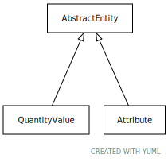

# Type: abstract entity

Any thing that is not a process or a physical mass-bearing entity

URI: [biolink:AbstractEntity](https://w3id.org/biolink/vocab/AbstractEntity)

## Children

 * [Attribute](Attribute.md) - A property or characteristic of an entity. For example, an apple may have properties such as color, shape, age, crispiness. An environmental sample may have attributes such as depth, lat, long, material.
 * [QuantityValue](QuantityValue.md) - A value of an attribute that is quantitative and measurable, expressed as a combination of a unit and a numeric value

## Referenced by class

## Attributes

