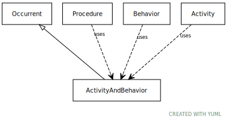

# Type: activity and behavior

Activity or behavior of any independent integral living, organization or mechanical actor in the world

URI: [biolink:ActivityAndBehavior](https://w3id.org/biolink/vocab/ActivityAndBehavior)

## Parents

 *  is_a: [Occurrent](Occurrent.md) - A processual entity

## Attributes

### Inherited from occurrent:

 * [category](category.md)  1..*
    * Description: Name of the high level ontology class in which this entity is categorized. Corresponds to the label for the biolink entity type class. In a neo4j database this MAY correspond to the neo4j label tag
    * range: [CategoryType](types/CategoryType.md)
    * in subsets: (translator_minimal)
 * [id](id.md)  REQ
    * Description: A unique identifier for a thing. Must be either a CURIE shorthand for a URI or a complete URI
    * range: [String](types/String.md)
    * in subsets: (translator_minimal)
 * [name](name.md)  REQ
    * Description: A human-readable name for a thing
    * range: [LabelType](types/LabelType.md)
    * in subsets: (translator_minimal)

## Other properties

|  |  |  |
| --- | --- | --- |
| **Mappings:** | | UMLSSG:ACTI |
|  | | UMLSSC:T051 |
|  | | UMLSST:evnt |
|  | | UMLSSC:T052 |
|  | | UMLSST:acty |
|  | | UMLSSC:T053 |
|  | | UMLSST:bhvr |
|  | | UMLSSC:T054 |
|  | | UMLSST:socb |
|  | | UMLSSC:T055 |
|  | | UMLSST:inbe |
|  | | UMLSSC:T056 |
|  | | UMLSST:dora |
|  | | UMLSSC:T057 |
|  | | UMLSST:ocac |
|  | | UMLSSC:T064 |
|  | | UMLSST:gora |
|  | | UMLSSC:T066 |
|  | | UMLSST:mcha |

