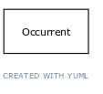

# Class: activity and behavior

Activity or behavior of any independent integral living, organization or mechanical actor in the world

URI: [biolink:ActivityAndBehavior](https://w3id.org/biolink/vocab/ActivityAndBehavior)

## Parents

 *  is_a: [Occurrent](Occurrent.md) - A processual entity

## Attributes

### Inherited from named thing:

 * [id](id.md)  REQ
    * Description: A unique identifier for a thing. Must be either a CURIE shorthand for a URI or a complete URI
    * range: [IdentifierType](IdentifierType.md)
    * inherited from: [NamedThing](NamedThing.md)
    * in subsets: (translator_minimal)
 * [name](name.md)  REQ
    * Description: A human-readable name for a thing
    * range: [LabelType](LabelType.md)
    * inherited from: [NamedThing](NamedThing.md)
    * in subsets: (translator_minimal)
 * [category](category.md)  1..*
    * Description: Name of the high level ontology class in which this entity is categorized. Corresponds to the label for the biolink entity type class. In a neo4j database this MAY correspond to the neo4j label tag
    * range: [IriType](IriType.md)
    * inherited from: [NamedThing](NamedThing.md)
    * in subsets: (translator_minimal)
