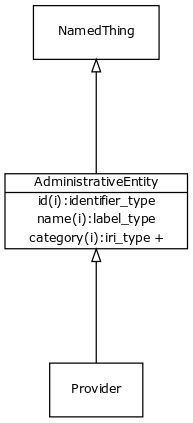

# Class: administrative entity

URI: [http://bioentity.io/vocab/AdministrativeEntity](http://bioentity.io/vocab/AdministrativeEntity)

## Mappings

## Inheritance

## Children

 * [Provider](Provider.md) - person, group, organization or project that provides a piece of information
## Used in

## Fields

