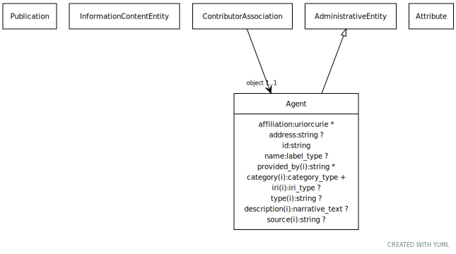

# Class: agent

person, group, organization or project that provides a piece of information (i.e. a knowledge association)

URI: [biolink:Agent](https://w3id.org/biolink/vocab/Agent)

## Identifier prefixes

 * isbn
 * ORCID
 * ScopusID
 * ResearchID
 * GSID
 * isni

## Parents

 *  is_a: [AdministrativeEntity](AdministrativeEntity.md)

## Referenced by Class

 *  **[Publication](Publication.md)** *[authors](authors.md)*  0..\*  **[Agent](Agent.md)**
 *  **[ContributorAssociation](ContributorAssociation.md)** *[contributor association➞object](contributor_association_object.md)*  1..1  **[Agent](Agent.md)**
 *  **[Publication](Publication.md)** *[has author](has_author.md)*  0..\*  **[Agent](Agent.md)**
 *  **[InformationContentEntity](InformationContentEntity.md)** *[has contributor](has_contributor.md)*  0..\*  **[Agent](Agent.md)**
 *  **[Publication](Publication.md)** *[has editor](has_editor.md)*  0..\*  **[Agent](Agent.md)**
 *  **[InformationContentEntity](InformationContentEntity.md)** *[has provider](has_provider.md)*  0..\*  **[Agent](Agent.md)**
 *  **[Publication](Publication.md)** *[has publisher](has_publisher.md)*  0..\*  **[Agent](Agent.md)**

## Attributes

### Own

 * [affiliation](affiliation.md)  0..\*
     * Description: a professional relationship between one provider (often a person) within another provider (often an organization). Target provider identity should be specified by a CURIE. Providers may have multiple affiliations.
     * Range: [Uriorcurie](types/Uriorcurie.md)
 * [address](address.md)  0..1
     * Description: the particulars of the place where someone or an organization is situated.  For now, this slot is a simple text "blob" containing all relevant details of the given location for fitness of purpose. For the moment, this "address" can include other contact details such as email and phone number(?).
     * Range: [String](types/String.md)
 * [agent➞id](agent_id.md)  1..1
     * Description: Different classes of agents have distinct preferred identifiers. For publishers, use the ISBN publisher code. See https://grp.isbn-international.org/ for publisher code lookups. For editors, authors and  individual providers, use the individual's ORCID if available; Otherwise, a ScopusID, ResearchID or Google Scholar ID ('GSID') may be used if the author ORCID is unknown. Institutional agents could be identified by an International Standard Name Identifier ('ISNI') code.
     * Range: [String](types/String.md)
     * in subsets: (translator_minimal)
 * [agent➞name](agent_name.md)  0..1
     * Description: it is recommended that an author's 'name' property be formatted as "surname, firstname initial."
     * Range: [LabelType](types/LabelType.md)
     * in subsets: (translator_minimal,samples)

### Inherited from administrative entity:

 * [iri](iri.md)  0..1
     * Description: An IRI for an entity. This is determined by the id using expansion rules.
     * Range: [IriType](types/IriType.md)
     * in subsets: (translator_minimal,samples)
 * [type](type.md)  0..\*
     * Range: [String](types/String.md)
 * [description](description.md)  0..1
     * Description: a human-readable description of an entity
     * Range: [NarrativeText](types/NarrativeText.md)
     * in subsets: (translator_minimal)
 * [has attribute](has_attribute.md)  0..\*
     * Description: connects any entity to an attribute
     * Range: [Attribute](Attribute.md)
     * in subsets: (samples)
 * [provided by](provided_by.md)  0..\*
     * Description: The value in this node property represents the knowledge provider that created or assembled the node and all of its attributes.  Used internally to represent how a particular node made its way into a knowledge provider or graph.
     * Range: [String](types/String.md)
 * [xref](xref.md)  0..\*
     * Description: A database cross reference or alternative identifier for a NamedThing or edge between two  NamedThings.  This property should point to a database record or webpage that supports the existence of the edge, or  gives more detail about the edge. This property can be used on a node or edge to provide multiple URIs or CURIE cross references.
     * Range: [Uriorcurie](types/Uriorcurie.md)
     * in subsets: (translator_minimal)
 * [named thing➞category](named_thing_category.md)  1..\*
     * Description: Name of the high level ontology class in which this entity is categorized. Corresponds to the label for the biolink entity type class.
 * In a neo4j database this MAY correspond to the neo4j label tag.
 * In an RDF database it should be a biolink model class URI.
This field is multi-valued. It should include values for ancestors of the biolink class; for example, a protein such as Shh would have category values `biolink:Protein`, `biolink:GeneProduct`, `biolink:MolecularEntity`, ...
In an RDF database, nodes will typically have an rdf:type triples. This can be to the most specific biolink class, or potentially to a class more specific than something in biolink. For example, a sequence feature `f` may have a rdf:type assertion to a SO class such as TF_binding_site, which is more specific than anything in biolink. Here we would have categories {biolink:GenomicEntity, biolink:MolecularEntity, biolink:NamedThing}
     * Range: [CategoryType](types/CategoryType.md)
     * in subsets: (translator_minimal)

## Other properties

|  |  |  |
| --- | --- | --- |
| **Aliases:** | | group |
| **Exact Mappings:** | | prov:Agent |
|  | | dct:Agent |
| **Narrow Mappings:** | | UMLSSG:ORGA |
|  | | STY:T092 |
|  | | STY:T093 |
|  | | STY:T094 |
|  | | STY:T095 |
|  | | STY:T096 |

