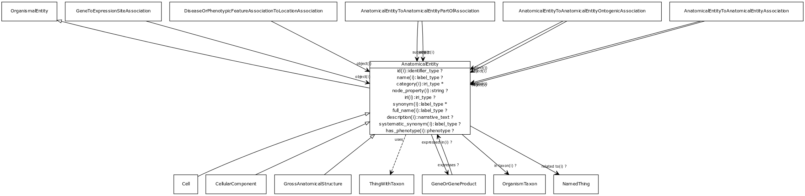

# Class: anatomical entity

A subcellular location, cell type or gross anatomical part

URI: [http://w3id.org/biolink/vocab/AnatomicalEntity](http://w3id.org/biolink/vocab/AnatomicalEntity)

## Mappings

 * [SIO:010046](http://semanticscience.org/resource/SIO_010046)
 * [WD:Q4936952](http://purl.obolibrary.org/obo/WD_Q4936952)
 * [UMLSSG:ANAT](http://purl.obolibrary.org/obo/UMLSSG_ANAT)
 * [UMLSSC:T022](http://purl.obolibrary.org/obo/UMLSSC_T022)
 * [UMLSST:bdsy](http://purl.obolibrary.org/obo/UMLSST_bdsy)
 * [UMLSSC:T029](http://purl.obolibrary.org/obo/UMLSSC_T029)
 * [UMLSST:blor](http://purl.obolibrary.org/obo/UMLSST_blor)
 * [UMLSSC:T030](http://purl.obolibrary.org/obo/UMLSSC_T030)
 * [UMLSST:bsoj](http://purl.obolibrary.org/obo/UMLSST_bsoj)
 * [UMLSSC:T031](http://purl.obolibrary.org/obo/UMLSSC_T031)
 * [UMLSST:bdsu](http://purl.obolibrary.org/obo/UMLSST_bdsu)
 * [UBERON:0001062](http://purl.obolibrary.org/obo/UBERON_0001062)
## Inheritance

 *  is_a: [OrganismalEntity](OrganismalEntity.md) - A named entity that is either a part of an organism, a whole organism, population or clade of organisms, excluding molecular entities
 *  mixin: [ThingWithTaxon](ThingWithTaxon.md) - A mixin that can be used on any entity with a taxon
## Children

 * [Cell](Cell.md)
 * [CellularComponent](CellularComponent.md) - A location in or around a cell
 * [GrossAnatomicalStructure](GrossAnatomicalStructure.md)
## Used in

 *  class: **[AnatomicalEntityToAnatomicalEntityAssociation](AnatomicalEntityToAnatomicalEntityAssociation.md)** *[anatomical entity to anatomical entity association.object](anatomical_entity_to_anatomical_entity_association_object.md)* **[AnatomicalEntity](AnatomicalEntity.md)**
 *  class: **[AnatomicalEntityToAnatomicalEntityAssociation](AnatomicalEntityToAnatomicalEntityAssociation.md)** *[anatomical entity to anatomical entity association.subject](anatomical_entity_to_anatomical_entity_association_subject.md)* **[AnatomicalEntity](AnatomicalEntity.md)**
 *  class: **[AnatomicalEntityToAnatomicalEntityOntogenicAssociation](AnatomicalEntityToAnatomicalEntityOntogenicAssociation.md)** *[anatomical entity to anatomical entity ontogenic association.object](anatomical_entity_to_anatomical_entity_ontogenic_association_object.md)* **[AnatomicalEntity](AnatomicalEntity.md)**
 *  class: **[AnatomicalEntityToAnatomicalEntityOntogenicAssociation](AnatomicalEntityToAnatomicalEntityOntogenicAssociation.md)** *[anatomical entity to anatomical entity ontogenic association.subject](anatomical_entity_to_anatomical_entity_ontogenic_association_subject.md)* **[AnatomicalEntity](AnatomicalEntity.md)**
 *  class: **[AnatomicalEntityToAnatomicalEntityPartOfAssociation](AnatomicalEntityToAnatomicalEntityPartOfAssociation.md)** *[anatomical entity to anatomical entity part of association.object](anatomical_entity_to_anatomical_entity_part_of_association_object.md)* **[AnatomicalEntity](AnatomicalEntity.md)**
 *  class: **[AnatomicalEntityToAnatomicalEntityPartOfAssociation](AnatomicalEntityToAnatomicalEntityPartOfAssociation.md)** *[anatomical entity to anatomical entity part of association.subject](anatomical_entity_to_anatomical_entity_part_of_association_subject.md)* **[AnatomicalEntity](AnatomicalEntity.md)**
 *  class: **[DiseaseOrPhenotypicFeatureAssociationToLocationAssociation](DiseaseOrPhenotypicFeatureAssociationToLocationAssociation.md)** *[disease or phenotypic feature association to location association.object](disease_or_phenotypic_feature_association_to_location_association_object.md)* **[AnatomicalEntity](AnatomicalEntity.md)**
 *  class: **[GeneOrGeneProduct](GeneOrGeneProduct.md)** *[expressed in](expressed_in.md)* **[AnatomicalEntity](AnatomicalEntity.md)**
 *  class: **[GeneToExpressionSiteAssociation](GeneToExpressionSiteAssociation.md)** *[gene to expression site association.object](gene_to_expression_site_association_object.md)* **[AnatomicalEntity](AnatomicalEntity.md)**
## Fields

 * [expresses](expresses.md) *subsets*: (translator_minimal)
    * Description: holds between an anatomical entity and gene or gene product that is expressed there
    * range: [GeneOrGeneProduct](GeneOrGeneProduct.md)
    * __Local__
 * [category](category.md) *subsets*: (translator_minimal)
    * Description: Name of the high level ontology class in which this entity is categorized. Corresponds to the label for the biolink entity type class. In a neo4j database this MAY correspond to the neo4j label tag
    * range: [IriType](IriType.md)*
    * inherited from: [NamedThing](NamedThing.md)
 * [description](description.md) *subsets*: (translator_minimal)
    * Description: a human-readable description of a thing
    * range: [NarrativeText](NarrativeText.md)
    * inherited from: [NamedThing](NamedThing.md)
 * [full name](full_name.md)
    * Description: a long-form human readable name for a thing
    * range: [LabelType](LabelType.md)
    * inherited from: [NamedThing](NamedThing.md)
 * [has phenotype](has_phenotype.md) *subsets*: (translator_minimal)
    * Description: holds between a biological entity and a phenotype, where a phenotype is construed broadly as any kind of quality of an organism part, a collection of these qualities, or a change in quality or qualities (e.g. abnormally increased temperature). 
    * range: [Phenotype](Phenotype.md)
    * inherited from: [BiologicalEntity](BiologicalEntity.md)
 * [id](id.md) *subsets*: (translator_minimal)
    * Description: A unique identifier for a thing. Must be either a CURIE shorthand for a URI or a complete URI
    * range: [IdentifierType](IdentifierType.md)
    * inherited from: [NamedThing](NamedThing.md)
 * [in taxon](in_taxon.md) *subsets*: (translator_minimal)
    * Description: connects a thing to a class representing a taxon
    * range: [OrganismTaxon](OrganismTaxon.md)
    * inherited from: [ThingWithTaxon](ThingWithTaxon.md)
 * [iri](iri.md) *subsets*: (translator_minimal)
    * Description: An IRI for the node. This is determined by the id using expansion rules.
    * range: [IriType](IriType.md)
    * inherited from: [NamedThing](NamedThing.md)
 * [name](name.md) *subsets*: (translator_minimal)
    * Description: A human-readable name for a thing
    * range: [LabelType](LabelType.md)
    * inherited from: [NamedThing](NamedThing.md)
 * [node property](node_property.md)
    * Description: A grouping for any property that holds between a node and a value
    * range: **string**
    * inherited from: [NamedThing](NamedThing.md)
 * [related to](related_to.md)
    * Description: A grouping for any relationship type that holds between any two things
    * range: [NamedThing](NamedThing.md)
    * inherited from: [NamedThing](NamedThing.md)
 * [synonym](synonym.md) *subsets*: (translator_minimal)
    * Description: Alternate human-readable names for a thing
    * range: [LabelType](LabelType.md)*
    * inherited from: [NamedThing](NamedThing.md)
 * [systematic synonym](systematic_synonym.md)
    * Description: more commonly used for gene symbols in yeast
    * range: [LabelType](LabelType.md)
    * inherited from: [NamedThing](NamedThing.md)
