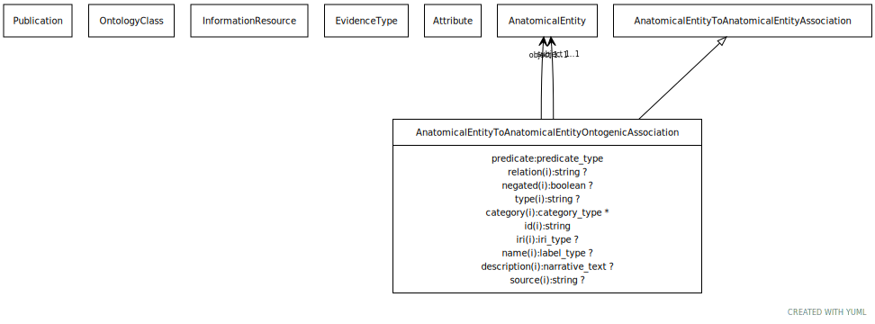

# Type: anatomical entity to anatomical entity ontogenic association

A relationship between two anatomical entities where the relationship is ontogenic, i.e the two entities are related by development. A number of different relationship types can be used to specify the precise nature of the relationship

URI: [biolink:AnatomicalEntityToAnatomicalEntityOntogenicAssociation](https://w3id.org/biolink/vocab/AnatomicalEntityToAnatomicalEntityOntogenicAssociation)

## Parents

 *  is_a: [AnatomicalEntityToAnatomicalEntityAssociation](AnatomicalEntityToAnatomicalEntityAssociation.md)

## Referenced by class

## Attributes

### Own

 * [anatomical entity to anatomical entity ontogenic association➞object](anatomical_entity_to_anatomical_entity_ontogenic_association_object.md)  REQ
    * Description: the structure at an earlier time
    * range: [AnatomicalEntity](AnatomicalEntity.md)
 * [anatomical entity to anatomical entity ontogenic association➞relation](anatomical_entity_to_anatomical_entity_ontogenic_association_relation.md)  REQ
    * range: [Uriorcurie](types/Uriorcurie.md)
 * [anatomical entity to anatomical entity ontogenic association➞subject](anatomical_entity_to_anatomical_entity_ontogenic_association_subject.md)  REQ
    * Description: the structure at a later time
    * range: [AnatomicalEntity](AnatomicalEntity.md)

### Inherited from anatomical entity to anatomical entity association:

 * [association type](association_type.md)  OPT
    * Description: connects an association to the type of association (e.g. gene to phenotype)
    * range: [OntologyClass](OntologyClass.md)
 * [association➞id](association_id.md)  REQ
    * Description: A unique identifier for an association
    * range: [String](types/String.md)
    * in subsets: (translator_minimal)
 * [negated](negated.md)  OPT
    * Description: if set to true, then the association is negated i.e. is not true
    * range: [Boolean](types/Boolean.md)
 * [provided by](provided_by.md)  0..*
    * Description: connects an association to the agent (person, organization or group) that provided it
    * range: [Provider](Provider.md)
 * [publications](publications.md)  0..*
    * Description: connects an association to publications supporting the association
    * range: [Publication](Publication.md)
 * [qualifiers](qualifiers.md)  0..*
    * Description: connects an association to qualifiers that modify or qualify the meaning of that association
    * range: [OntologyClass](OntologyClass.md)
