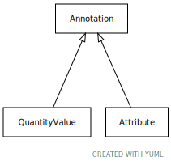

# Class: annotation

Biolink Model root class for entity annotations.

URI: [biolink:Annotation](https://w3id.org/biolink/vocab/Annotation)

## Children

 * [QuantityValue](QuantityValue.md) - A value of an attribute that is quantitative and measurable, expressed as a combination of a unit and a numeric value

## Referenced by Class

## Attributes

