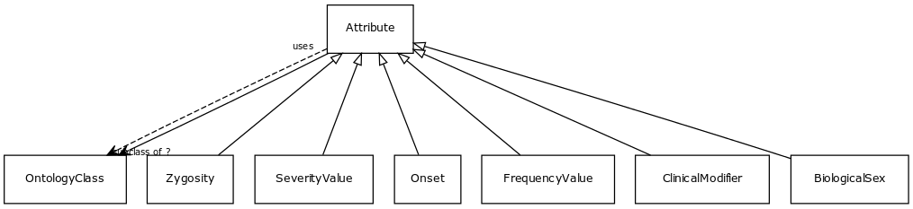

# Class: attribute

A property or characteristic of an entity

URI: [http://bioentity.io/vocab/Attribute](http://bioentity.io/vocab/Attribute)

## Mappings

 * [PATO:0000001](http://purl.obolibrary.org/obo/PATO_0000001)
## Inheritance

 *  mixin: [OntologyClass](OntologyClass.md) - a concept or class in an ontology, vocabulary or thesaurus
## Children

 * [BiologicalSex](BiologicalSex.md)
 * [ClinicalModifier](ClinicalModifier.md) - Used to characterize and specify the phenotypic abnormalities defined in the Phenotypic abnormality subontology, with respect to severity, laterality, age of onset, and other aspects
 * [FrequencyValue](FrequencyValue.md) - describes the frequency of occurrence of an event or condition
 * [Onset](Onset.md) - The age group in which manifestations appear
 * [SeverityValue](SeverityValue.md) - describes the severity of a phenotypic feature or disease
 * [Zygosity](Zygosity.md)
## Used in

## Fields

 * [category](category.md) *subsets*: (translator_minimal)
    * Description: Name of the high level ontology class in which this entity is categorized. Corresponds to the label for the biolink entity type class. In a neo4j database this MAY correspond to the neo4j label tag
    * range: [LabelType](LabelType.md)
    * inherited from: [NamedThing](NamedThing.md)
 * [description](description.md) *subsets*: (translator_minimal)
    * Description: a human-readable description of a thing
    * range: [NarrativeText](NarrativeText.md)
    * inherited from: [NamedThing](NamedThing.md)
 * [full name](full_name.md)
    * Description: a long-form human readable name for a thing
    * range: [LabelType](LabelType.md)
    * inherited from: [NamedThing](NamedThing.md)
 * [id](id.md) *subsets*: (translator_minimal)
    * Description: A unique identifier for a thing. Must be either a CURIE shorthand for a URI or a complete URI
    * range: [IdentifierType](IdentifierType.md)
    * inherited from: [NamedThing](NamedThing.md)
 * [iri](iri.md) *subsets*: (translator_minimal)
    * Description: An IRI for the node. This is determined by the id using expansion rules.
    * range: [IriType](IriType.md)
    * inherited from: [NamedThing](NamedThing.md)
 * [name](name.md) *subsets*: (translator_minimal)
    * Description: A human-readable name for a thing
    * range: [LabelType](LabelType.md)
    * inherited from: [NamedThing](NamedThing.md)
 * [node property](node_property.md)
    * Description: A grouping for any property that holds between a node and a value
    * range: **string**
    * inherited from: [NamedThing](NamedThing.md)
 * [related to](related_to.md)
    * Description: A grouping for any relationship type that holds between any two things
    * range: [NamedThing](NamedThing.md)
    * inherited from: [NamedThing](NamedThing.md)
 * [subclass of](subclass_of.md) *subsets*: (translator_minimal)
    * Description: holds between two classes where the domain class is a specialization of the range class
    * range: [OntologyClass](OntologyClass.md)
    * inherited from: [OntologyClass](OntologyClass.md)
 * [systematic synonym](systematic_synonym.md)
    * Description: more commonly used for gene symbols in yeast
    * range: [LabelType](LabelType.md)
    * inherited from: [NamedThing](NamedThing.md)
