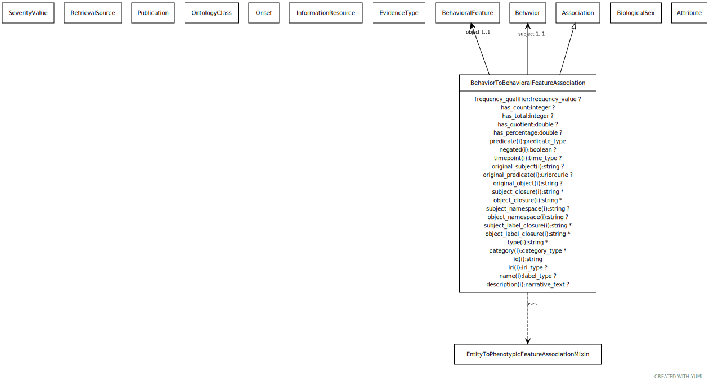

# Class: behavior to behavioral feature association

An association between an mixture behavior and a behavioral feature manifested by the individual exhibited or has exhibited the behavior.

URI: [biolink:BehaviorToBehavioralFeatureAssociation](https://w3id.org/biolink/vocab/BehaviorToBehavioralFeatureAssociation)

## Parents

 *  is_a: [Association](Association.md) - A typed association between two entities, supported by evidence

## Uses Mixin

 *  mixin: [EntityToPhenotypicFeatureAssociationMixin](EntityToPhenotypicFeatureAssociationMixin.md)

## Referenced by Class

## Attributes

### Own

 * [behavior to behavioral feature association➞subject](behavior_to_behavioral_feature_association_subject.md)  1..1
     * Description: behavior that is the subject of the association
     * Range: [Behavior](Behavior.md)
 * [behavior to behavioral feature association➞object](behavior_to_behavioral_feature_association_object.md)  1..1
     * Description: behavioral feature that is the object of the association
     * Range: [BehavioralFeature](BehavioralFeature.md)

### Inherited from association:

 * [id](id.md)  1..1
     * Description: A unique identifier for an entity. Must be either a CURIE shorthand for a URI or a complete URI
     * Range: [String](types/String.md)
     * in subsets: (translator_minimal)
 * [iri](iri.md)  0..1
     * Description: An IRI for an entity. This is determined by the id using expansion rules.
     * Range: [IriType](types/IriType.md)
     * in subsets: (translator_minimal,samples)
 * [name](name.md)  0..1
     * Description: A human-readable name for an attribute or entity.
     * Range: [LabelType](types/LabelType.md)
     * in subsets: (translator_minimal,samples)
 * [description](description.md)  0..1
     * Description: a human-readable description of an entity
     * Range: [NarrativeText](types/NarrativeText.md)
     * in subsets: (translator_minimal)
 * [has attribute](has_attribute.md)  0..\*
     * Description: connects any entity to an attribute
     * Range: [Attribute](Attribute.md)
     * in subsets: (samples)
 * [predicate](predicate.md)  1..1
     * Description: A high-level grouping for the relationship type. AKA minimal predicate. This is analogous to category for nodes.
     * Range: [PredicateType](types/PredicateType.md)
 * [negated](negated.md)  0..1
     * Description: if set to true, then the association is negated i.e. is not true
     * Range: [Boolean](types/Boolean.md)
 * [qualifiers](qualifiers.md)  0..\*
     * Description: connects an association to qualifiers that modify or qualify the meaning of that association
     * Range: [OntologyClass](OntologyClass.md)
 * [publications](publications.md)  0..\*
     * Description: One or more publications that report the statement expressed in an  Association, or provide information used as evidence supporting this statement.
     * Range: [Publication](Publication.md)
 * [has evidence](has_evidence.md)  0..\*
     * Description: connects an association to an instance of supporting evidence
     * Range: [EvidenceType](EvidenceType.md)
 * [knowledge source](knowledge_source.md)  0..1
     * Description: An Information Resource from which the knowledge expressed in an Association was retrieved, directly or indirectly. This can be any resource through which the knowledge passed on its way to its currently serialized form. In practice, implementers should use one of the more specific subtypes of this generic property.
     * Range: [InformationResource](InformationResource.md)
 * [primary knowledge source](primary_knowledge_source.md)  0..1
     * Description: The most upstream source of the knowledge expressed in an Association that an implementer can identify.  Performing a rigorous analysis of upstream data providers is expected; every effort is made to catalog the most upstream source of data in this property.  Only one data source should be declared primary in any association.  "aggregator knowledge source" can be used to capture non-primary sources.
     * Range: [InformationResource](InformationResource.md)
 * [aggregator knowledge source](aggregator_knowledge_source.md)  0..\*
     * Description: An intermediate aggregator resource from which knowledge expressed in an Association was retrieved downstream of the original source, on its path to its current serialized form.
     * Range: [InformationResource](InformationResource.md)
 * [timepoint](timepoint.md)  0..1
     * Description: a point in time
     * Range: [TimeType](types/TimeType.md)
 * [original subject](original_subject.md)  0..1
     * Description: used to hold the original subject of a relation (or predicate) that an external knowledge source uses before transformation to match the biolink-model specification.
     * Range: [String](types/String.md)
 * [original predicate](original_predicate.md)  0..1
     * Description: used to hold the original relation/predicate that an external knowledge source uses before transformation to match the biolink-model specification.
     * Range: [Uriorcurie](types/Uriorcurie.md)
 * [original object](original_object.md)  0..1
     * Description: used to hold the original object of a relation (or predicate) that an external knowledge source uses before transformation to match the biolink-model specification.
     * Range: [String](types/String.md)
 * [subject category](subject_category.md)  0..1
     * Description: Used to hold the biolink class/category of an association. This is a denormalized  field used primarily in the SQL serialization of a knowledge graph via KGX.
     * Range: [OntologyClass](OntologyClass.md)
     * Example: biolink:Gene The subject category of the association between the gene 'BRCA1' and the disease 'breast cancer' is 'biolink:Gene'.
 * [object category](object_category.md)  0..1
     * Description: Used to hold the biolink class/category of an association. This is a denormalized  field used primarily in the SQL serialization of a knowledge graph via KGX.
     * Range: [OntologyClass](OntologyClass.md)
     * Example: biolink:Disease The object category of the association between the gene 'BRCA1' and the disease 'breast cancer' is 'biolink:Disease'.
 * [subject closure](subject_closure.md)  0..\*
     * Description: Used to hold the subject closure of an association. This is a denormalized  field used primarily in the SQL serialization of a knowledge graph via KGX.
     * Range: [String](types/String.md)
 * [object closure](object_closure.md)  0..\*
     * Description: Used to hold the object closure of an association. This is a denormalized  field used primarily in the SQL serialization of a knowledge graph via KGX.
     * Range: [String](types/String.md)
     * Example: ['MONDO:0000167', 'MONDO:0005395'] The object closure of the association between the gene 'BRCA1' and the disease 'breast cancer' is the set of all diseases that are ancestors of 'breast cancer' in the MONDO ontology.  Note: typically the "subclass of" and "part of"  relations are used to construct the closure, but other relations may be used as well.
 * [subject category closure](subject_category_closure.md)  0..\*
     * Description: Used to hold the subject category closure of an association. This is a denormalized  field used primarily in the SQL serialization of a knowledge graph via KGX.
     * Range: [OntologyClass](OntologyClass.md)
     * Example: ['biolink:Gene", "biolink:NamedThing'] The subject category closure of the association between the gene 'BRCA1' and the disease 'breast cancer' is the set of all biolink classes that are ancestors of 'biolink:Gene' in the biolink model.  Note: typically the "subclass of" and "part of"  relations are used to construct the closure, but other relations may be used as well.
 * [object category closure](object_category_closure.md)  0..\*
     * Description: Used to hold the object category closure of an association. This is a denormalized  field used primarily in the SQL serialization of a knowledge graph via KGX.
     * Range: [OntologyClass](OntologyClass.md)
     * Example: ['biolink:Disease", "biolink:NamedThing'] The object category closure of the association between the gene 'BRCA1' and the disease 'breast cancer' is the set of all biolink classes that are ancestors of 'biolink:Disease' in the biolink model.  Note: typically the "subclass of" and "part of"  relations are used to construct the closure, but other relations may be used as well.
 * [subject namespace](subject_namespace.md)  0..1
     * Description: Used to hold the subject namespace of an association. This is a denormalized  field used primarily in the SQL serialization of a knowledge graph via KGX.
     * Range: [String](types/String.md)
     * Example: NCBIGene The subject namespace of the association between the gene 'BRCA1' and the disease 'breast cancer' is 'NCBIGene'.
 * [object namespace](object_namespace.md)  0..1
     * Description: Used to hold the object namespace of an association. This is a denormalized  field used primarily in the SQL serialization of a knowledge graph via KGX.
     * Range: [String](types/String.md)
     * Example: MONDO The object namespace of the association between the gene 'BRCA1' and the disease 'breast cancer' is 'MONDO'.
 * [subject label closure](subject_label_closure.md)  0..\*
     * Description: Used to hold the subject label closure of an association. This is a denormalized  field used primarily in the SQL serialization of a knowledge graph via KGX.
     * Range: [String](types/String.md)
     * Example: ['BRACA1'] The subject label closure of the association between the gene 'BRCA1' and the disease 'breast cancer' is the set of all labels that are ancestors of 'BRCA1' in the biolink model.
 * [object label closure](object_label_closure.md)  0..\*
     * Description: Used to hold the object label closure of an association. This is a denormalized  field used primarily in the SQL serialization of a knowledge graph via KGX.
     * Range: [String](types/String.md)
     * Example: ['breast cancer', 'cancer'] The object label closure of the association between the gene 'BRCA1' and the disease 'breast cancer' is the set of all labels that are ancestors of 'breast cancer' in the biolink model.
 * [retrieval source ids](retrieval_source_ids.md)  0..\*
     * Description: A list of retrieval sources that served as a source of knowledge expressed in an Edge, or a source of data used to generate this knowledge.
     * Range: [RetrievalSource](RetrievalSource.md)
     * in subsets: (translator_minimal)
 * [association➞type](association_type.md)  0..\*
     * Description: rdf:type of biolink:Association should be fixed at rdf:Statement
     * Range: [String](types/String.md)
 * [association➞category](association_category.md)  0..\*
     * Description: Name of the high level ontology class in which this entity is categorized. Corresponds to the label for the biolink entity type class.
 * In a neo4j database this MAY correspond to the neo4j label tag.
 * In an RDF database it should be a biolink model class URI.
This field is multi-valued. It should include values for ancestors of the biolink class; for example, a protein such as Shh would have category values `biolink:Protein`, `biolink:GeneProduct`, `biolink:MolecularEntity`, ...
In an RDF database, nodes will typically have an rdf:type triples. This can be to the most specific biolink class, or potentially to a class more specific than something in biolink. For example, a sequence feature `f` may have a rdf:type assertion to a SO class such as TF_binding_site, which is more specific than anything in biolink. Here we would have categories {biolink:GenomicEntity, biolink:MolecularEntity, biolink:NamedThing}
     * Range: [CategoryType](types/CategoryType.md)
     * in subsets: (translator_minimal)

### Mixed in from frequency qualifier mixin:

 * [frequency qualifier](frequency_qualifier.md)  0..1
     * Description: a qualifier used in a phenotypic association to state how frequent the phenotype is observed in the subject
     * Range: [FrequencyValue](types/FrequencyValue.md)
     * in subsets: (translator_minimal)

### Mixed in from entity to feature or disease qualifiers mixin:

 * [severity qualifier](severity_qualifier.md)  0..1
     * Description: a qualifier used in a phenotypic association to state how severe the phenotype is in the subject
     * Range: [SeverityValue](SeverityValue.md)
     * in subsets: (translator_minimal)

### Mixed in from entity to feature or disease qualifiers mixin:

 * [onset qualifier](onset_qualifier.md)  0..1
     * Description: a qualifier used in a phenotypic association to state when the phenotype appears is in the subject
     * Range: [Onset](Onset.md)
     * in subsets: (translator_minimal)

### Mixed in from entity to phenotypic feature association mixin:

 * [sex qualifier](sex_qualifier.md)  0..1
     * Description: a qualifier used in a phenotypic association to state whether the association is specific to a particular sex.
     * Range: [BiologicalSex](BiologicalSex.md)
     * in subsets: (translator_minimal)
