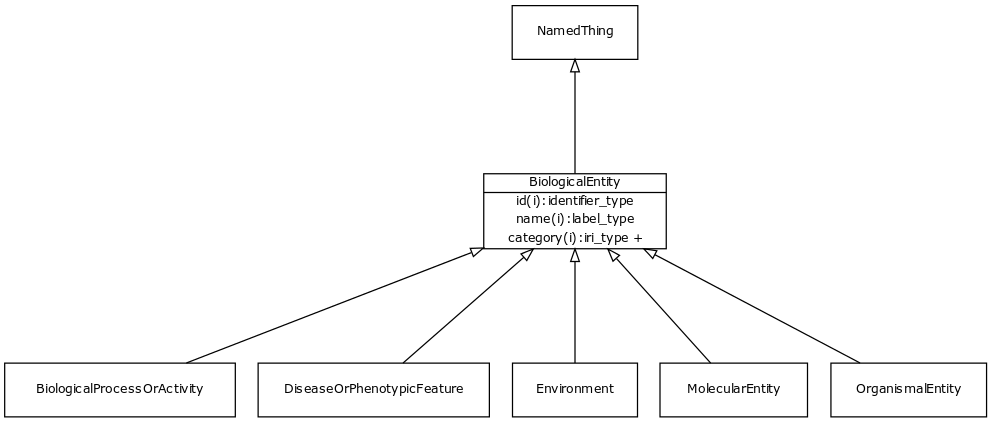

# Class: biological entity

URI: [http://bioentity.io/vocab/BiologicalEntity](http://bioentity.io/vocab/BiologicalEntity)

## Mappings

 * [WD:Q28845870](http://purl.obolibrary.org/obo/WD_Q28845870)
## Inheritance

 *  is_a: [NamedThing](NamedThing.md) - a databased entity or concept/class
## Children

 * [BiologicalProcessOrActivity](BiologicalProcessOrActivity.md) - Either an individual molecular activity, or a collection of causally connected molecular activities
 * [DiseaseOrPhenotypicFeature](DiseaseOrPhenotypicFeature.md) - Either one of a disease or an individual phenotypic feature. Some knowledge resources such as Monarch treat these as distinct, others such as MESH conflate.
 * [Environment](Environment.md) - A feature of the environment of an organism that influences one or more phenotypic features of that organism, potentially mediated by genes
 * [MolecularEntity](MolecularEntity.md) - A gene, gene product, small molecule or macromolecule (including protein complex)
 * [OrganismalEntity](OrganismalEntity.md) - A named entity that is either a part of an organism, a whole organism, population or clade of organisms, excluding molecular entities
## Used in

## Fields

 * [has phenotype](has_phenotype.md) *subsets*: (translator_minimal)
    * Description: holds between a biological entity and a phenotype, where a phenotype is construed broadly as any kind of quality of an organism part, a collection of these qualities, or a change in quality or qualities (e.g. abnormally increased temperature). 
    * range: [Phenotype](Phenotype.md)
    * __Local__
 * [category](category.md) *subsets*: (translator_minimal)
    * Description: Name of the high level ontology class in which this entity is categorized. Corresponds to the label for the biolink entity type class. In a neo4j database this MAY correspond to the neo4j label tag
    * range: [IriType](IriType.md)*
    * inherited from: [NamedThing](NamedThing.md)
 * [description](description.md) *subsets*: (translator_minimal)
    * Description: a human-readable description of a thing
    * range: [NarrativeText](NarrativeText.md)
    * inherited from: [NamedThing](NamedThing.md)
 * [full name](full_name.md)
    * Description: a long-form human readable name for a thing
    * range: [LabelType](LabelType.md)
    * inherited from: [NamedThing](NamedThing.md)
 * [id](id.md) *subsets*: (translator_minimal)
    * Description: A unique identifier for a thing. Must be either a CURIE shorthand for a URI or a complete URI
    * range: [IdentifierType](IdentifierType.md)
    * inherited from: [NamedThing](NamedThing.md)
 * [iri](iri.md) *subsets*: (translator_minimal)
    * Description: An IRI for the node. This is determined by the id using expansion rules.
    * range: [IriType](IriType.md)
    * inherited from: [NamedThing](NamedThing.md)
 * [name](name.md) *subsets*: (translator_minimal)
    * Description: A human-readable name for a thing
    * range: [LabelType](LabelType.md)
    * inherited from: [NamedThing](NamedThing.md)
 * [node property](node_property.md)
    * Description: A grouping for any property that holds between a node and a value
    * range: **string**
    * inherited from: [NamedThing](NamedThing.md)
 * [related to](related_to.md)
    * Description: A grouping for any relationship type that holds between any two things
    * range: [NamedThing](NamedThing.md)
    * inherited from: [NamedThing](NamedThing.md)
 * [systematic synonym](systematic_synonym.md)
    * Description: more commonly used for gene symbols in yeast
    * range: [LabelType](LabelType.md)
    * inherited from: [NamedThing](NamedThing.md)
