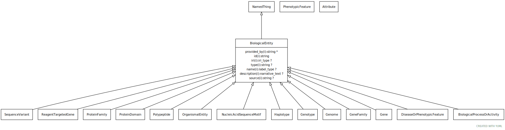

# Type: biological entity

URI: [biolink:BiologicalEntity](https://w3id.org/biolink/vocab/BiologicalEntity)

## Parents

 *  is_a: [NamedThing](NamedThing.md) - a databased entity or concept/class

## Children

 * [BiologicalProcessOrActivity](BiologicalProcessOrActivity.md) - Either an individual molecular activity, or a collection of causally connected molecular activities
 * [DiseaseOrPhenotypicFeature](DiseaseOrPhenotypicFeature.md) - Either one of a disease or an individual phenotypic feature. Some knowledge resources such as Monarch treat these as distinct, others such as MESH conflate.
 * [ExposureEvent](ExposureEvent.md) - A feature of the environment of an organism that influences one or more phenotypic features of that organism, potentially mediated by genes
 * [MolecularEntity](MolecularEntity.md) - A gene, gene product, small molecule or macromolecule (including protein complex)
 * [OrganismalEntity](OrganismalEntity.md) - A named entity that is either a part of an organism, a whole organism, population or clade of organisms, excluding molecular entities

## Referenced by class

## Attributes

### Inherited from named thing:

 * [category](category.md)  1..*
    * Description: Name of the high level ontology class in which this entity is categorized. Corresponds to the label for the biolink entity type class. In a neo4j database this MAY correspond to the neo4j label tag
    * range: [CategoryType](types/CategoryType.md)
    * in subsets: (translator_minimal)
 * [id](id.md)  REQ
    * Description: A unique identifier for a thing. Must be either a CURIE shorthand for a URI or a complete URI
    * range: [String](types/String.md)
    * in subsets: (translator_minimal)
 * [name](name.md)  REQ
    * Description: A human-readable name for a thing
    * range: [LabelType](types/LabelType.md)
    * in subsets: (translator_minimal)

## Other properties

|  |  |  |
| --- | --- | --- |
| **Mappings:** | | WIKIDATA:Q28845870 |
|  | | UMLSSC:T050 |
|  | | UMLSST:emod |

