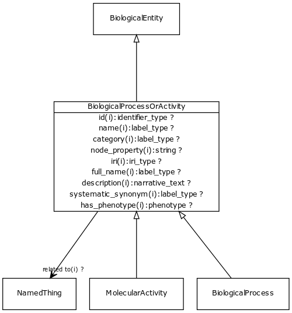

# Class: biological process or activity

Either an individual molecular activity, or a collection of causally connected molecular activities

URI: [http://bioentity.io/vocab/BiologicalProcessOrActivity](http://bioentity.io/vocab/BiologicalProcessOrActivity)

## Mappings

## Inheritance

 *  is_a: [biological entity](BiologicalEntity.md)
## Children

 *  child: [molecular activity](MolecularActivity.md) - An execution of a molecular function carried out by a gene product or macromolecular complex.
 *  child: [biological process](BiologicalProcess.md) - One or more causally connected executions of molecular functions
## Used in

 *  class: [biological process or activity](BiologicalProcessOrActivity.md) references: [molecular activity](MolecularActivity.md)
 *  class: [biological process or activity](BiologicalProcessOrActivity.md) references: [biological process](BiologicalProcess.md)
## Fields

 * _[related to](related_to.md)_
    * _A grouping for any relationship type that holds between any two things_
    * range: [named thing](NamedThing.md)
    * inherited from: [named thing](NamedThing.md)
