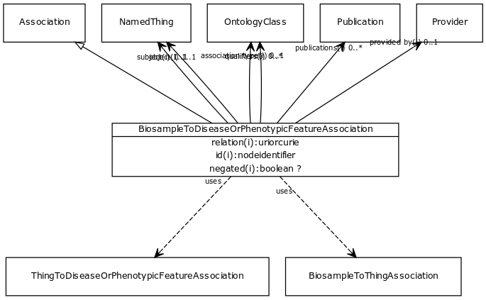

# Class: biosample to disease or phenotypic feature association

An association between a biosample and a disease or phenotype
  definitional: true

URI: [http://bioentity.io/vocab/BiosampleToDiseaseOrPhenotypicFeatureAssociation](http://bioentity.io/vocab/BiosampleToDiseaseOrPhenotypicFeatureAssociation)

## Mappings

## Inheritance

 *  is_a: [association](Association.md) - A typed association between two entities, supported by evidence
 *  mixin: [biosample to thing association](BiosampleToThingAssociation.md) - An association between a biosample and something
 *  mixin: [thing to disease or phenotypic feature association](ThingToDiseaseOrPhenotypicFeatureAssociation.md)
## Children

## Fields

 * _[related to](related_to.md)_
    * _A grouping for any relationship type that holds between any two things_
    * range: [named thing](NamedThing.md)
    * inherited from: [named thing](NamedThing.md)
 * _[association type](association_type.md)_
    * _connects an association to the type of association (e.g. gene to phenotype)_
    * range: [ontology class](OntologyClass.md)
    * inherited from: None
 * _[relation](relation.md)_
    * _the relationship type by which a subject is connected to an object in an association_
    * range: [relationship type](RelationshipType.md) [required]
    * inherited from: None
 * _[qualifiers](qualifiers.md)_
    * _connects an association to qualifiers that modify or qualify the meaning of that association_
    * range: [ontology class](OntologyClass.md)*
    * inherited from: None
 * _[publications](publications.md)_
    * _connects an association to publications supporting the association_
    * range: [publication](Publication.md)*
    * inherited from: None
 * _[provided by](provided_by.md)_
    * _connects an association to the agent (person, organization or group) that provided it_
    * range: [provider](Provider.md)
    * inherited from: None
