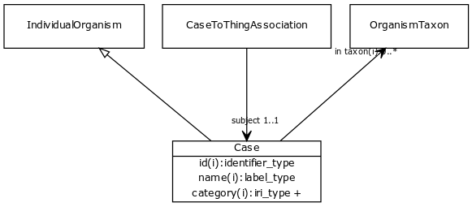

# Class: case

An individual organism that has a patient role in some clinical context.

URI: [http://bioentity.io/vocab/Case](http://bioentity.io/vocab/Case)

## Mappings

## Inheritance

 *  is_a: [individual organism](IndividualOrganism.md)
## Children

## Used in

## Fields

 * _[related to](related_to.md)_
    * _A grouping for any relationship type that holds between any two things_
    * range: [named thing](NamedThing.md)
    * inherited from: [named thing](NamedThing.md)
 * _[in taxon](in_taxon.md) *subsets: translator_minimal*_
    * _connects a thing to a class representing a taxon_
    * range: [organism taxon](OrganismTaxon.md)
    * inherited from: [thing with taxon](ThingWithTaxon.md)
