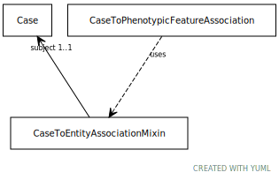

# Class: case to entity association mixin

An abstract association for use where the case is the subject

URI: [biolink:CaseToEntityAssociationMixin](https://w3id.org/biolink/vocab/CaseToEntityAssociationMixin)

## Mixin for

 * [CaseToPhenotypicFeatureAssociation](CaseToPhenotypicFeatureAssociation.md) (mixin)  - An association between a case (e.g. individual patient) and a phenotypic feature in which the individual has or has had the phenotype.

## Referenced by Class

## Attributes

### Own

 * [case to entity association mixin➞subject](case_to_entity_association_mixin_subject.md)  1..1
     * Description: the case (e.g. patient) that has the property
     * Range: [Case](Case.md)
