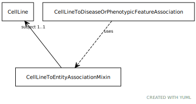

# Class: cell line to entity association mixin

An relationship between a cell line and another entity

URI: [biolink:CellLineToEntityAssociationMixin](https://w3id.org/biolink/vocab/CellLineToEntityAssociationMixin)

## Mixin for

 * [CellLineToDiseaseOrPhenotypicFeatureAssociation](CellLineToDiseaseOrPhenotypicFeatureAssociation.md) (mixin)  - An relationship between a cell line and a disease or a phenotype, where the cell line is derived from an individual with that disease or phenotype.

## Referenced by Class

## Attributes

### Own

 * [cell line to entity association mixin➞subject](cell_line_to_entity_association_mixin_subject.md)  1..1
     * Description: connects an association to the subject of the association. For example, in a gene-to-phenotype association, the gene is subject and phenotype is object.
     * Range: [CellLine](CellLine.md)
