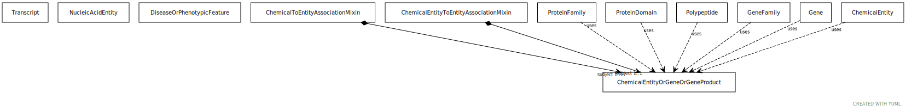

# Class: chemical entity or gene or gene product

A union of chemical entities and children, and gene or gene product. This mixin is helpful to use when searching across chemical entities that must include genes and their children as chemical entities.

URI: [biolink:ChemicalEntityOrGeneOrGeneProduct](https://w3id.org/biolink/vocab/ChemicalEntityOrGeneOrGeneProduct)

## Mixin for

 * [AccessibleDnaRegion](AccessibleDnaRegion.md) (mixin)  - A region (or regions) of a chromatinized genome that has been measured to be more accessible to an enzyme such as DNase-I or Tn5 Transpose
 * [ChemicalEntity](ChemicalEntity.md) (mixin)  - A chemical entity is a physical entity that pertains to chemistry or biochemistry.
 * [Gene](Gene.md) (mixin)  - A region (or regions) that includes all of the sequence elements necessary to encode a functional transcript. A gene locus may include regulatory regions, transcribed regions and/or other functional sequence regions.
 * [GeneFamily](GeneFamily.md) (mixin)  - any grouping of multiple genes or gene products related by common descent
 * [Polypeptide](Polypeptide.md) (mixin)  - A polypeptide is a molecular entity characterized by availability in protein databases of amino-acid-based sequence representations of its precise primary structure; for convenience of representation, partial sequences of various kinds are included, even if they do not represent a physical molecule.
 * [ProteinDomain](ProteinDomain.md) (mixin)  - A conserved part of protein sequence and (tertiary) structure that can evolve, function, and exist independently of the rest of the protein chain. Protein domains maintain their structure and function independently of the proteins in which they are found. e.g. an SH3 domain.
 * [ProteinFamily](ProteinFamily.md) (mixin) 
 * [RegulatoryRegion](RegulatoryRegion.md) (mixin)  - A region (or regions) of the genome that contains known or putative regulatory elements that act in cis- or trans- to affect the transcription of gene
 * [TranscriptionFactorBindingSite](TranscriptionFactorBindingSite.md) (mixin)  - A region (or regions) of the genome that contains a region of DNA known or predicted to bind a protein that modulates gene transcription

## Referenced by Class

 *  **[ChemicalEntityOrGeneOrGeneProduct](ChemicalEntityOrGeneOrGeneProduct.md)** *[affects response to](affects_response_to.md)*  0..\*  **[ChemicalEntityOrGeneOrGeneProduct](ChemicalEntityOrGeneOrGeneProduct.md)**
 *  **[ChemicalEntityOrGeneOrGeneProductRegulatesGeneAssociation](ChemicalEntityOrGeneOrGeneProductRegulatesGeneAssociation.md)** *[chemical entity or gene or gene product regulates gene association➞subject](chemical_entity_or_gene_or_gene_product_regulates_gene_association_subject.md)*  1..1  **[ChemicalEntityOrGeneOrGeneProduct](ChemicalEntityOrGeneOrGeneProduct.md)**
 *  **[ChemicalEntityToEntityAssociationMixin](ChemicalEntityToEntityAssociationMixin.md)** *[chemical entity to entity association mixin➞subject](chemical_entity_to_entity_association_mixin_subject.md)*  1..1  **[ChemicalEntityOrGeneOrGeneProduct](ChemicalEntityOrGeneOrGeneProduct.md)**
 *  **[ChemicalToEntityAssociationMixin](ChemicalToEntityAssociationMixin.md)** *[chemical to entity association mixin➞subject](chemical_to_entity_association_mixin_subject.md)*  1..1  **[ChemicalEntityOrGeneOrGeneProduct](ChemicalEntityOrGeneOrGeneProduct.md)**
 *  **[ChemicalEntityOrGeneOrGeneProduct](ChemicalEntityOrGeneOrGeneProduct.md)** *[decreases response to](decreases_response_to.md)*  0..\*  **[ChemicalEntityOrGeneOrGeneProduct](ChemicalEntityOrGeneOrGeneProduct.md)**
 *  **[DiseaseOrPhenotypicFeature](DiseaseOrPhenotypicFeature.md)** *[has biomarker](has_biomarker.md)*  0..\*  **[ChemicalEntityOrGeneOrGeneProduct](ChemicalEntityOrGeneOrGeneProduct.md)**
 *  **[MolecularActivity](MolecularActivity.md)** *[has substrate](has_substrate.md)*  0..\*  **[ChemicalEntityOrGeneOrGeneProduct](ChemicalEntityOrGeneOrGeneProduct.md)**
 *  **[ChemicalEntityOrGeneOrGeneProduct](ChemicalEntityOrGeneOrGeneProduct.md)** *[increases response to](increases_response_to.md)*  0..\*  **[ChemicalEntityOrGeneOrGeneProduct](ChemicalEntityOrGeneOrGeneProduct.md)**
 *  **[ChemicalEntityOrGeneOrGeneProduct](ChemicalEntityOrGeneOrGeneProduct.md)** *[response affected by](response_affected_by.md)*  0..\*  **[ChemicalEntityOrGeneOrGeneProduct](ChemicalEntityOrGeneOrGeneProduct.md)**
 *  **[ChemicalEntityOrGeneOrGeneProduct](ChemicalEntityOrGeneOrGeneProduct.md)** *[response decreased by](response_decreased_by.md)*  0..\*  **[ChemicalEntityOrGeneOrGeneProduct](ChemicalEntityOrGeneOrGeneProduct.md)**
 *  **[ChemicalEntityOrGeneOrGeneProduct](ChemicalEntityOrGeneOrGeneProduct.md)** *[response increased by](response_increased_by.md)*  0..\*  **[ChemicalEntityOrGeneOrGeneProduct](ChemicalEntityOrGeneOrGeneProduct.md)**

## Attributes

