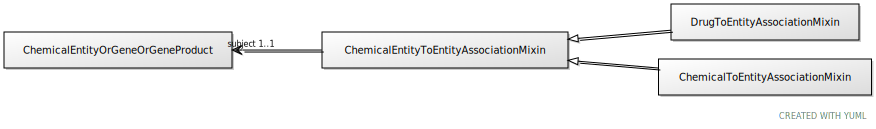

# Class: chemical entity to entity association mixin

An interaction between a chemical entity and another entity

URI: [biolink:ChemicalEntityToEntityAssociationMixin](https://w3id.org/biolink/vocab/ChemicalEntityToEntityAssociationMixin)

## Children

 * [ChemicalToEntityAssociationMixin](ChemicalToEntityAssociationMixin.md)
 * [DrugToEntityAssociationMixin](DrugToEntityAssociationMixin.md) - An interaction between a drug and another entity

## Referenced by Class

## Attributes

### Own

 * [chemical entity to entity association mixin➞subject](chemical_entity_to_entity_association_mixin_subject.md)  1..1
     * Description: the chemical entity that is an interactor
     * Range: [ChemicalEntityOrGeneOrGeneProduct](ChemicalEntityOrGeneOrGeneProduct.md)
