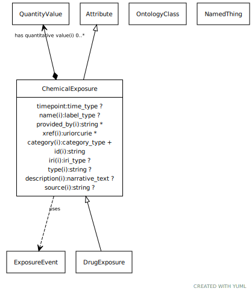

# Type: chemical exposure

A chemical exposure is an intake of a particular chemical substance

URI: [biolink:ChemicalExposure](https://w3id.org/biolink/vocab/ChemicalExposure)

## Parents

 *  is_a: [ExposureEvent](ExposureEvent.md) - A feature of the environment of an organism that influences one or more phenotypic features of that organism, potentially mediated by genes

## Children

 * [DrugExposure](DrugExposure.md) - A drug exposure is an intake of a particular chemical substance

## Referenced by class

## Attributes

### Inherited from exposure event:

 * [category](category.md)  1..*
    * Description: Name of the high level ontology class in which this entity is categorized. Corresponds to the label for the biolink entity type class. In a neo4j database this MAY correspond to the neo4j label tag
    * range: [CategoryType](types/CategoryType.md)
    * in subsets: (translator_minimal)
 * [id](id.md)  REQ
    * Description: A unique identifier for a thing. Must be either a CURIE shorthand for a URI or a complete URI
    * range: [String](types/String.md)
    * in subsets: (translator_minimal)
 * [name](name.md)  REQ
    * Description: A human-readable name for a thing
    * range: [LabelType](types/LabelType.md)
    * in subsets: (translator_minimal)

## Other properties

|  |  |  |
| --- | --- | --- |
| **Mappings:** | | ECTO:9000000 |
|  | | SIO:001399 |

