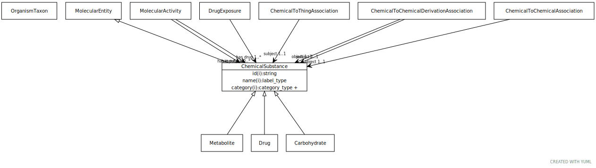

# Type: chemical substance

May be a chemical entity or a formulation with a chemical entity as active ingredient, or a complex material with multiple chemical entities as part

URI: [biolink:ChemicalSubstance](https://w3id.org/biolink/vocab/ChemicalSubstance)

## Parents

 *  is_a: [MolecularEntity](MolecularEntity.md) - A gene, gene product, small molecule or macromolecule (including protein complex)

## Children

 * [Carbohydrate](Carbohydrate.md)
 * [Drug](Drug.md) - A substance intended for use in the diagnosis, cure, mitigation, treatment, or prevention of disease
 * [Metabolite](Metabolite.md) - Any intermediate or product resulting from metabolism. Includes primary and secondary metabolites.

## Referenced by class

 *  **[ChemicalToChemicalAssociation](ChemicalToChemicalAssociation.md)** *[chemical to chemical association➞object](chemical_to_chemical_association_object.md)*  REQ  **[ChemicalSubstance](ChemicalSubstance.md)**
 *  **[ChemicalToChemicalDerivationAssociation](ChemicalToChemicalDerivationAssociation.md)** *[chemical to chemical derivation association➞object](chemical_to_chemical_derivation_association_object.md)*  REQ  **[ChemicalSubstance](ChemicalSubstance.md)**
 *  **[ChemicalToChemicalDerivationAssociation](ChemicalToChemicalDerivationAssociation.md)** *[chemical to chemical derivation association➞subject](chemical_to_chemical_derivation_association_subject.md)*  REQ  **[ChemicalSubstance](ChemicalSubstance.md)**
 *  **[ChemicalToThingAssociation](ChemicalToThingAssociation.md)** *[chemical to thing association➞subject](chemical_to_thing_association_subject.md)*  REQ  **[ChemicalSubstance](ChemicalSubstance.md)**
 *  **[DrugExposure](DrugExposure.md)** *[drug exposure➞has drug](drug_exposure_has_drug.md)*  1..*  **[ChemicalSubstance](ChemicalSubstance.md)**
 *  **[MolecularActivity](MolecularActivity.md)** *[molecular activity➞has input](molecular_activity_has_input.md)*  0..*  **[ChemicalSubstance](ChemicalSubstance.md)**
 *  **[MolecularActivity](MolecularActivity.md)** *[molecular activity➞has output](molecular_activity_has_output.md)*  0..*  **[ChemicalSubstance](ChemicalSubstance.md)**

## Attributes

### Inherited from molecular entity:

 * [category](category.md)  1..*
    * Description: Name of the high level ontology class in which this entity is categorized. Corresponds to the label for the biolink entity type class. In a neo4j database this MAY correspond to the neo4j label tag
    * range: [CategoryType](types/CategoryType.md)
    * in subsets: (translator_minimal)
 * [id](id.md)  REQ
    * Description: A unique identifier for a thing. Must be either a CURIE shorthand for a URI or a complete URI
    * range: [String](types/String.md)
    * in subsets: (translator_minimal)
 * [name](name.md)  REQ
    * Description: A human-readable name for a thing
    * range: [LabelType](types/LabelType.md)
    * in subsets: (translator_minimal)

## Other properties

|  |  |  |
| --- | --- | --- |
| **Mappings:** | | SIO:010004 |
|  | | WIKIDATA:Q79529 |
|  | | UMLSSC:T167 |
|  | | UMLSST:sbst |
|  | | UMLSSG:CHEM |
|  | | UMLSSC:T103 |
|  | | UMLSST:chem |
|  | | UMLSSC:T104 |
|  | | UMLSST:chvs |
|  | | UMLSSC:T109 |
|  | | UMLSST:orch |
|  | | UMLSSC:T114 |
|  | | UMLSST:nnon |
|  | | UMLSSC:T120 |
|  | | UMLSST:chvf |
|  | | UMLSSC:T121 |
|  | | UMLSST:phsu |
|  | | UMLSSC:T122 |
|  | | UMLSST:bodm |
|  | | UMLSSC:T123 |
|  | | UMLSST:bacs |
|  | | UMLSSC:T125 |
|  | | UMLSST:horm |
|  | | UMLSSC:T126 |
|  | | UMLSST:enzy |
|  | | UMLSSC:T127 |
|  | | UMLSST:vita |
|  | | UMLSSC:T129 |
|  | | UMLSST:imft |
|  | | UMLSSC:T130 |
|  | | UMLSST:irda |
|  | | UMLSSC:T131 |
|  | | UMLSST:hops |
|  | | UMLSSC:T192 |
|  | | UMLSST:rcpt |
|  | | UMLSSC:T195 |
|  | | UMLSST:antb |
|  | | UMLSSC:T196 |
|  | | UMLSST:elii |
|  | | UMLSSC:T197 |
|  | | UMLSST:inch |

