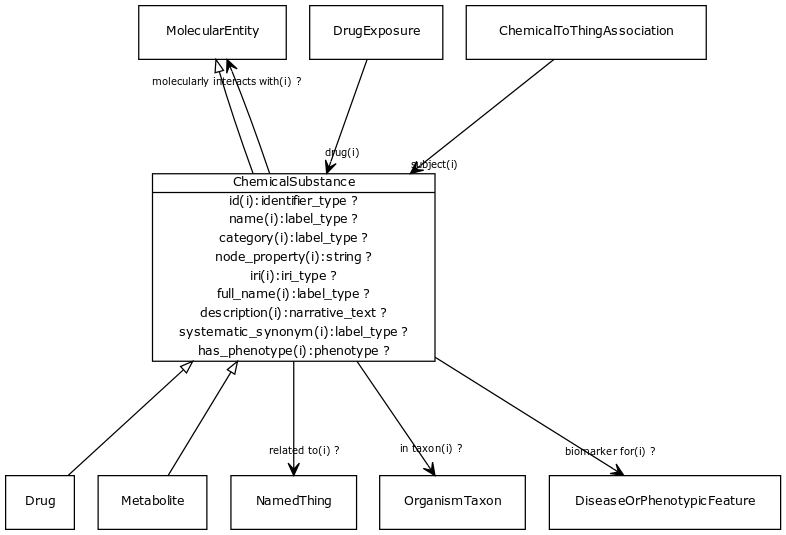

# Class: chemical substance

May be a chemical entity or a formulation with a chemical entity as active ingredient, or a complex material with multiple chemical entities as part

URI: [biolink:ChemicalSubstance](https://w3id.org/biolink/vocab/ChemicalSubstance)

## Parents

 *  is_a: [MolecularEntity](MolecularEntity.md) - A gene, gene product, small molecule or macromolecule (including protein complex)

## Children

 * [Carbohydrate](Carbohydrate.md)
 * [Drug](Drug.md) - A substance intended for use in the diagnosis, cure, mitigation, treatment, or prevention of disease
 * [Metabolite](Metabolite.md) - Any intermediate or product resulting from metabolism. Includes primary and secondary metabolites.

## Referenced by class

 *  **[ChemicalToChemicalAssociation](ChemicalToChemicalAssociation.md)** *[object](chemical_to_chemical_association_object.md)*  REQ  **[ChemicalSubstance](ChemicalSubstance.md)**
 *  **[ChemicalToChemicalDerivationAssociation](ChemicalToChemicalDerivationAssociation.md)** *[object](chemical_to_chemical_derivation_association_object.md)*  REQ  **[ChemicalSubstance](ChemicalSubstance.md)**
 *  **[ChemicalToChemicalDerivationAssociation](ChemicalToChemicalDerivationAssociation.md)** *[subject](chemical_to_chemical_derivation_association_subject.md)*  REQ  **[ChemicalSubstance](ChemicalSubstance.md)**
 *  **[ChemicalToThingAssociation](ChemicalToThingAssociation.md)** *[subject](chemical_to_thing_association_subject.md)*  REQ  **[ChemicalSubstance](ChemicalSubstance.md)**
 *  **[DrugExposure](DrugExposure.md)** *[drug](drug.md)*  1..*  **[ChemicalSubstance](ChemicalSubstance.md)**
 *  **[MolecularActivity](MolecularActivity.md)** *[has input](molecular_activity_has_input.md)*  0..*  **[ChemicalSubstance](ChemicalSubstance.md)**
 *  **[MolecularActivity](MolecularActivity.md)** *[has output](molecular_activity_has_output.md)*  0..*  **[ChemicalSubstance](ChemicalSubstance.md)**

## Attributes

### Inherited from named thing:

 * [id](id.md)  REQ
    * Description: A unique identifier for a thing. Must be either a CURIE shorthand for a URI or a complete URI
    * range: [IdentifierType](IdentifierType.md)
    * inherited from: [NamedThing](NamedThing.md)
    * in subsets: (translator_minimal)
 * [name](name.md)  REQ
    * Description: A human-readable name for a thing
    * range: [LabelType](LabelType.md)
    * inherited from: [NamedThing](NamedThing.md)
    * in subsets: (translator_minimal)
 * [category](category.md)  1..*
    * Description: Name of the high level ontology class in which this entity is categorized. Corresponds to the label for the biolink entity type class. In a neo4j database this MAY correspond to the neo4j label tag
    * range: [IriType](IriType.md)
    * inherited from: [NamedThing](NamedThing.md)
    * in subsets: (translator_minimal)

### Inherited from thing with taxon:

 * [in taxon](in_taxon.md)  0..*
    * Description: connects a thing to a class representing a taxon
    * range: [OrganismTaxon](OrganismTaxon.md)
    * inherited from: [ThingWithTaxon](ThingWithTaxon.md)
    * in subsets: (translator_minimal)
