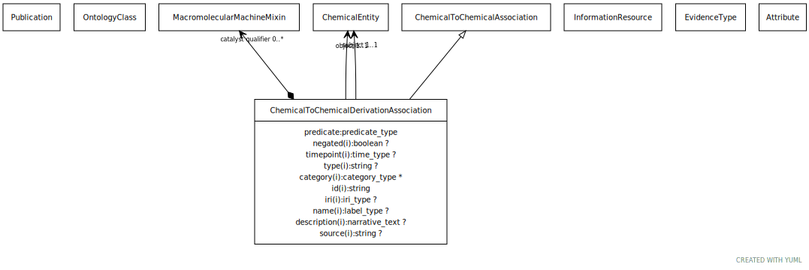

# Type: chemical to chemical derivation association

A causal relationship between two chemical entities, where the subject represents the upstream entity and the object represents the downstream. For any such association there is an implicit reaction:
  IF
  R has-input C1 AND
  R has-output C2 AND
  R enabled-by P AND
  R type Reaction
  THEN
  C1 derives-into C2 <<change is catalyzed by P>>

URI: [biolink:ChemicalToChemicalDerivationAssociation](https://w3id.org/biolink/vocab/ChemicalToChemicalDerivationAssociation)

## Parents

 *  is_a: [ChemicalToChemicalAssociation](ChemicalToChemicalAssociation.md) - A relationship between two chemical entities. This can encompass actual interactions as well as temporal causal edges, e.g. one chemical converted to another.

## Referenced by class

## Attributes

### Own

 * [chemical to chemical derivation association➞change is catalyzed by](chemical_to_chemical_derivation_association_change_is_catalyzed_by.md)  0..*
    * Description: this connects the derivation edge to the molecular entity that catalyzes the reaction that causes the subject chemical to transform into the object chemical
    * range: [MacromolecularMachine](MacromolecularMachine.md)
 * [chemical to chemical derivation association➞object](chemical_to_chemical_derivation_association_object.md)  REQ
    * Description: the downstream chemical entity
    * range: [ChemicalSubstance](ChemicalSubstance.md)
 * [chemical to chemical derivation association➞relation](chemical_to_chemical_derivation_association_relation.md)  REQ
    * range: [Uriorcurie](types/Uriorcurie.md)
 * [chemical to chemical derivation association➞subject](chemical_to_chemical_derivation_association_subject.md)  REQ
    * Description: the upstream chemical entity
    * range: [ChemicalSubstance](ChemicalSubstance.md)

### Inherited from chemical to chemical association:

 * [association type](association_type.md)  OPT
    * Description: connects an association to the type of association (e.g. gene to phenotype)
    * range: [OntologyClass](OntologyClass.md)
 * [association➞id](association_id.md)  REQ
    * Description: A unique identifier for an association
    * range: [String](types/String.md)
    * in subsets: (translator_minimal)
 * [negated](negated.md)  OPT
    * Description: if set to true, then the association is negated i.e. is not true
    * range: [Boolean](types/Boolean.md)
 * [provided by](provided_by.md)  0..*
    * Description: connects an association to the agent (person, organization or group) that provided it
    * range: [Provider](Provider.md)
 * [publications](publications.md)  0..*
    * Description: connects an association to publications supporting the association
    * range: [Publication](Publication.md)
 * [qualifiers](qualifiers.md)  0..*
    * Description: connects an association to qualifiers that modify or qualify the meaning of that association
    * range: [OntologyClass](OntologyClass.md)
