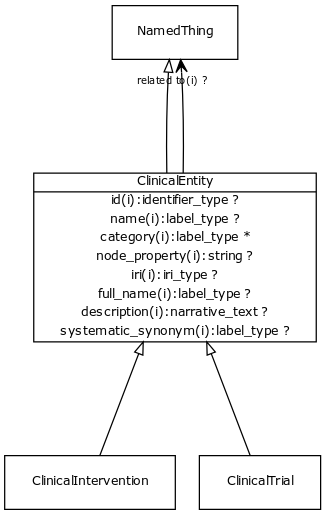

# Class: clinical entity

Any entity or process that exists in the clinical domain and outside the biological realm. Diseases are placed under biological entities

URI: [http://bioentity.io/vocab/ClinicalEntity](http://bioentity.io/vocab/ClinicalEntity)

## Mappings

## Inheritance

 *  is_a: [named thing](NamedThing.md) - a databased entity or concept/class
## Children

 *  child: [clinical trial](ClinicalTrial.md)
 *  child: [clinical intervention](ClinicalIntervention.md)
## Used in

 *  class: [clinical entity](ClinicalEntity.md) references: [clinical trial](ClinicalTrial.md)
 *  class: [clinical entity](ClinicalEntity.md) references: [clinical intervention](ClinicalIntervention.md)
## Fields

 * _[related to](related_to.md)_
    * _A grouping for any relationship type that holds between any two things_
    * range: [named thing](NamedThing.md)
    * inherited from: [named thing](NamedThing.md)
