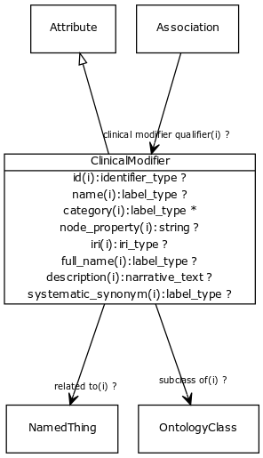

# Class: clinical modifier

Used to characterize and specify the phenotypic abnormalities defined in the Phenotypic abnormality subontology, with respect to severity, laterality, age of onset, and other aspects

URI: [http://bioentity.io/vocab/ClinicalModifier](http://bioentity.io/vocab/ClinicalModifier)

## Mappings

 * [HP:0012823](http://purl.obolibrary.org/obo/HP_0012823)
## Inheritance

 *  is_a: [Attribute](Attribute.md) - A property or characteristic of an entity
## Children

## Used in

 *  class: **[Association](Association.md)** *[clinical modifier qualifier](clinical_modifier_qualifier.md)* **[ClinicalModifier](ClinicalModifier.md)**
## Fields

 * _[subclass of](subclass_of.md) *subsets*: (translator_minimal)_
    * _holds between two classes where the domain class is a specialization of the range class_
    * range: [OntologyClass](OntologyClass.md)
    * inherited from: [OntologyClass](OntologyClass.md)
