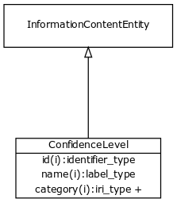

# Class: confidence level

Level of confidence in a statement

URI: [http://bioentity.io/vocab/ConfidenceLevel](http://bioentity.io/vocab/ConfidenceLevel)

## Mappings

 * [CIO:0000028](http://purl.obolibrary.org/obo/CIO_0000028)
## Inheritance

 *  is_a: [information content entity](InformationContentEntity.md) - a piece of information that typically describes some piece of biology or is used as support.
## Children

## Used in

## Fields

 * _[related to](related_to.md)_
    * _A grouping for any relationship type that holds between any two things_
    * range: [named thing](NamedThing.md)
    * inherited from: [named thing](NamedThing.md)
