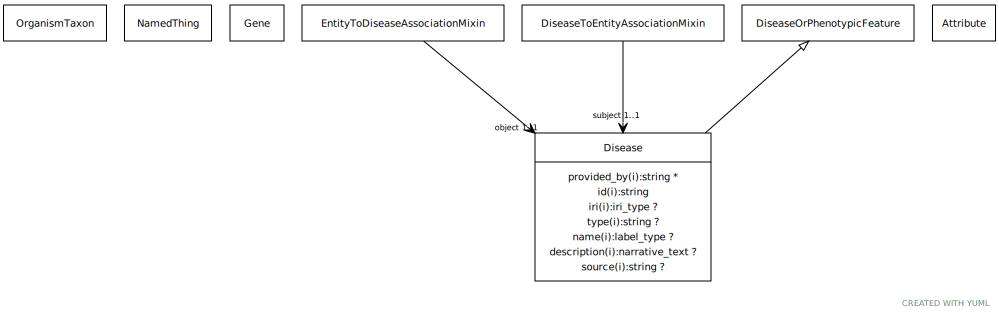

# Type: disease

URI: [biolink:Disease](https://w3id.org/biolink/vocab/Disease)

## Parents

 *  is_a: [DiseaseOrPhenotypicFeature](DiseaseOrPhenotypicFeature.md) - Either one of a disease or an individual phenotypic feature. Some knowledge resources such as Monarch treat these as distinct, others such as MESH conflate.

## Referenced by class

 *  **[DiseaseToExposureAssociation](DiseaseToExposureAssociation.md)** *[disease to exposure association➞subject](disease_to_exposure_association_subject.md)*  REQ  **[Disease](Disease.md)**
 *  **[DiseaseToThingAssociation](DiseaseToThingAssociation.md)** *[disease to thing association➞subject](disease_to_thing_association_subject.md)*  REQ  **[Disease](Disease.md)**
 *  **[EntityToDiseaseAssociation](EntityToDiseaseAssociation.md)** *[entity to disease association➞object](entity_to_disease_association_object.md)*  REQ  **[Disease](Disease.md)**
 *  **[NamedThing](NamedThing.md)** *[manifestation of](manifestation_of.md)*  0..*  **[Disease](Disease.md)**

## Attributes

### Inherited from disease or phenotypic feature:

 * [category](category.md)  1..*
    * Description: Name of the high level ontology class in which this entity is categorized. Corresponds to the label for the biolink entity type class. In a neo4j database this MAY correspond to the neo4j label tag
    * range: [CategoryType](types/CategoryType.md)
    * in subsets: (translator_minimal)
 * [id](id.md)  REQ
    * Description: A unique identifier for a thing. Must be either a CURIE shorthand for a URI or a complete URI
    * range: [String](types/String.md)
    * in subsets: (translator_minimal)
 * [name](name.md)  REQ
    * Description: A human-readable name for a thing
    * range: [LabelType](types/LabelType.md)
    * in subsets: (translator_minimal)

## Other properties

|  |  |  |
| --- | --- | --- |
| **Aliases:** | | condition |
|  | | disorder |
|  | | medical condition |
| **Mappings:** | | MONDO:0000001 |
|  | | DOID:4 |
|  | | WIKIDATA:Q12136 |
|  | | SIO:010299 |
|  | | UMLSSG:DISO |
|  | | UMLSSC:T019 |
|  | | UMLSST:cgab |
|  | | UMLSSC:T020 |
|  | | UMLSST:acab |
|  | | UMLSSC:T037 |
|  | | UMLSST:inpo |
|  | | UMLSSC:T046 |
|  | | UMLSST:patf |
|  | | UMLSSC:T047 |
|  | | UMLSST:dsyn |
|  | | UMLSSC:T048 |
|  | | UMLSST:mobd |
|  | | UMLSSC:T049 |
|  | | UMLSST:comd |
|  | | UMLSSC:T184 |
|  | | UMLSST:sosy |
|  | | UMLSSC:T190 |
|  | | UMLSST:anab |
|  | | UMLSSC:T191 |
|  | | UMLSST:neop |

