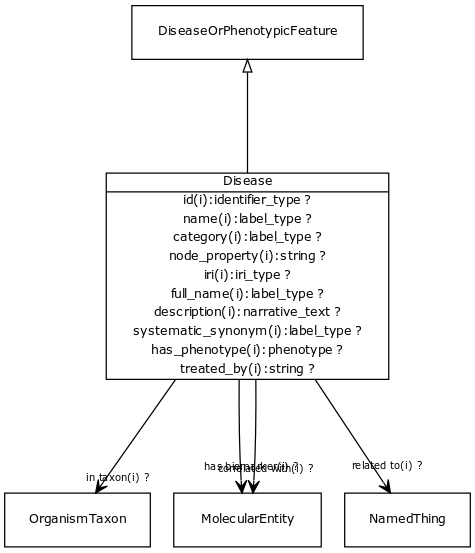

# Class: disease

URI: [http://bioentity.io/vocab/Disease](http://bioentity.io/vocab/Disease)

## Mappings

 * [MONDO:0000001](http://purl.obolibrary.org/obo/MONDO_0000001)
 * [WD:Q12136](http://purl.obolibrary.org/obo/WD_Q12136)
 * [SIO:010299](http://semanticscience.org/resource/SIO_010299)
 * [UMLSSG:DISO](http://purl.obolibrary.org/obo/UMLSSG_DISO)
## Inheritance

 *  is_a: [disease or phenotypic feature](DiseaseOrPhenotypicFeature.md) - Either one of a disease or an individual phenotypic feature. Some knowledge resources such as Monarch treat these as distinct, others such as MESH conflate.
## Children

## Used in

 *  class: [disease](Disease.md) references: [disease or phenotypic feature](DiseaseOrPhenotypicFeature.md)
## Fields

 * _[related to](related_to.md)_
    * _A grouping for any relationship type that holds between any two things_
    * range: [named thing](NamedThing.md)
    * inherited from: [named thing](NamedThing.md)
 * _[correlated with](correlated_with.md) *subsets: translator_minimal*_
    * _holds between a disease or phenotypic feature and a measurable molecular entity that is used as an indicator of the presence or state of the disease or feature._
    * range: [molecular entity](MolecularEntity.md)
    * inherited from: [disease or phenotypic feature](DiseaseOrPhenotypicFeature.md)
 * _[has biomarker](has_biomarker.md) *subsets: translator_minimal*_
    * _holds between a disease or phenotypic feature and a measurable molecular entity that is used as an indicator of the presence or state of the disease or feature._
    * range: [molecular entity](MolecularEntity.md)
    * inherited from: [disease or phenotypic feature](DiseaseOrPhenotypicFeature.md)
 * _[in taxon](in_taxon.md) *subsets: translator_minimal*_
    * _connects a thing to a class representing a taxon_
    * range: [organism taxon](OrganismTaxon.md)
    * inherited from: [thing with taxon](ThingWithTaxon.md)
