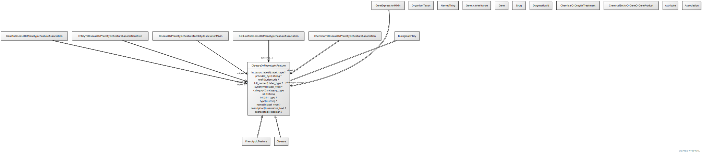

# Type: disease or phenotypic feature

Either one of a disease or an individual phenotypic feature. Some knowledge resources such as Monarch treat these as distinct, others such as MESH conflate.

URI: [biolink:DiseaseOrPhenotypicFeature](https://w3id.org/biolink/vocab/DiseaseOrPhenotypicFeature)

## Parents

 *  is_a: [BiologicalEntity](BiologicalEntity.md)

## Uses Mixins

 *  mixin: [ThingWithTaxon](ThingWithTaxon.md) - A mixin that can be used on any entity with a taxon

## Children

 * [Disease](Disease.md)
 * [PhenotypicFeature](PhenotypicFeature.md)

## Referenced by class

 *  **[MolecularEntity](MolecularEntity.md)** *[biomarker for](biomarker_for.md)*  0..*  **[DiseaseOrPhenotypicFeature](DiseaseOrPhenotypicFeature.md)**
 *  **[Drug](Drug.md)** *[causes adverse event](causes_adverse_event.md)*  0..*  **[DiseaseOrPhenotypicFeature](DiseaseOrPhenotypicFeature.md)**
 *  **[CellLineToDiseaseOrPhenotypicFeatureAssociation](CellLineToDiseaseOrPhenotypicFeatureAssociation.md)** *[cell line to disease or phenotypic feature association➞subject](cell_line_to_disease_or_phenotypic_feature_association_subject.md)*  REQ  **[DiseaseOrPhenotypicFeature](DiseaseOrPhenotypicFeature.md)**
 *  **[ChemicalToDiseaseOrPhenotypicFeatureAssociation](ChemicalToDiseaseOrPhenotypicFeatureAssociation.md)** *[chemical to disease or phenotypic feature association➞object](chemical_to_disease_or_phenotypic_feature_association_object.md)*  REQ  **[DiseaseOrPhenotypicFeature](DiseaseOrPhenotypicFeature.md)**
 *  **[Drug](Drug.md)** *[contraindicated for](contraindicated_for.md)*  0..*  **[DiseaseOrPhenotypicFeature](DiseaseOrPhenotypicFeature.md)**
 *  **[DiseaseOrPhenotypicFeatureAssociationToThingAssociation](DiseaseOrPhenotypicFeatureAssociationToThingAssociation.md)** *[disease or phenotypic feature association to thing association➞subject](disease_or_phenotypic_feature_association_to_thing_association_subject.md)*  REQ  **[DiseaseOrPhenotypicFeature](DiseaseOrPhenotypicFeature.md)**
 *  **[Gene](Gene.md)** *[gene associated with condition](gene_associated_with_condition.md)*  0..*  **[DiseaseOrPhenotypicFeature](DiseaseOrPhenotypicFeature.md)**
 *  **[ThingToDiseaseOrPhenotypicFeatureAssociation](ThingToDiseaseOrPhenotypicFeatureAssociation.md)** *[thing to disease or phenotypic feature association➞object](thing_to_disease_or_phenotypic_feature_association_object.md)*  REQ  **[DiseaseOrPhenotypicFeature](DiseaseOrPhenotypicFeature.md)**
 *  **[Treatment](Treatment.md)** *[treats](treats.md)*  1..*  **[DiseaseOrPhenotypicFeature](DiseaseOrPhenotypicFeature.md)**

## Attributes

### Inherited from biological entity:

 * [category](category.md)  1..*
    * Description: Name of the high level ontology class in which this entity is categorized. Corresponds to the label for the biolink entity type class. In a neo4j database this MAY correspond to the neo4j label tag
    * range: [CategoryType](types/CategoryType.md)
    * in subsets: (translator_minimal)
 * [id](id.md)  REQ
    * Description: A unique identifier for a thing. Must be either a CURIE shorthand for a URI or a complete URI
    * range: [String](types/String.md)
    * in subsets: (translator_minimal)
 * [name](name.md)  REQ
    * Description: A human-readable name for a thing
    * range: [LabelType](types/LabelType.md)
    * in subsets: (translator_minimal)

### Mixed in from thing with taxon:

 * [in taxon](in_taxon.md)  0..*
    * Description: connects a thing to a class representing a taxon
    * range: [OrganismTaxon](OrganismTaxon.md)
    * in subsets: (translator_minimal)

## Other properties

|  |  |  |
| --- | --- | --- |
| **Aliases:** | | phenome |
| **Mappings:** | | UMLSSC:T033 |
|  | | UMLSST:fndg |

