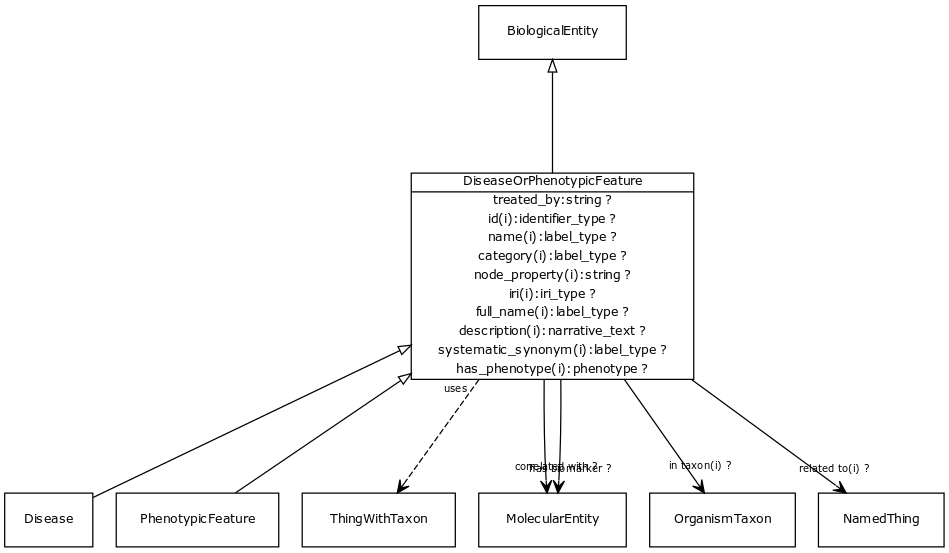

# Class: disease or phenotypic feature

Either one of a disease or an individual phenotypic feature. Some knowledge resources such as Monarch treat these as distinct, others such as MESH conflate.

URI: [http://bioentity.io/vocab/DiseaseOrPhenotypicFeature](http://bioentity.io/vocab/DiseaseOrPhenotypicFeature)

## Mappings

## Inheritance

 *  is_a: [biological entity](BiologicalEntity.md)
 *  mixin: [thing with taxon](ThingWithTaxon.md) - A mixin that can be used on any entity with a taxon
## Children

 *  child: [disease](Disease.md)
 *  child: [phenotypic feature](PhenotypicFeature.md)
## Used in

 *  class: [disease or phenotypic feature](DiseaseOrPhenotypicFeature.md) references: [disease](Disease.md)
 *  class: [disease or phenotypic feature](DiseaseOrPhenotypicFeature.md) references: [phenotypic feature](PhenotypicFeature.md)
## Fields

 * _[correlated with](correlated_with.md) *subsets: translator_minimal*_
    * _holds between a disease or phenotypic feature and a measurable molecular entity that is used as an indicator of the presence or state of the disease or feature._
    * range: [molecular entity](MolecularEntity.md)
    * __Local__
 * _[has biomarker](has_biomarker.md) *subsets: translator_minimal*_
    * _holds between a disease or phenotypic feature and a measurable molecular entity that is used as an indicator of the presence or state of the disease or feature._
    * range: [molecular entity](MolecularEntity.md)
    * __Local__
 * _[treated by](treated_by.md) *subsets: translator_minimal*_
    * _holds between a disease or phenotypic feature and a therapeutic process or chemical substance that is used to treat the condition _
    * range: string
    * __Local__
 * _[in taxon](in_taxon.md) *subsets: translator_minimal*_
    * _connects a thing to a class representing a taxon_
    * range: [organism taxon](OrganismTaxon.md)
    * __Local__
 * _[related to](related_to.md)_
    * _A grouping for any relationship type that holds between any two things_
    * range: [named thing](NamedThing.md)
    * inherited from: [named thing](NamedThing.md)
