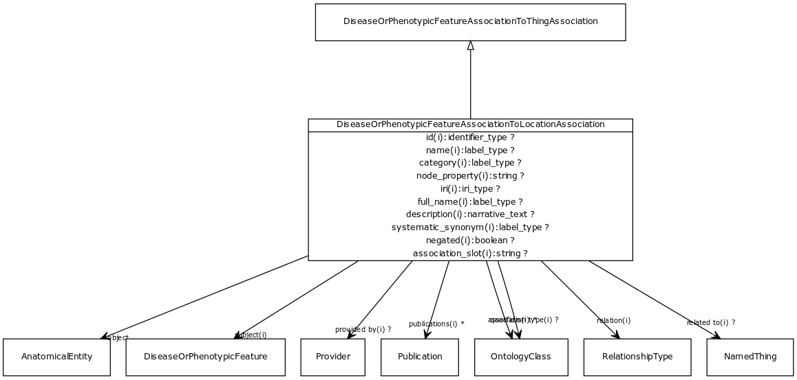

# Class: disease or phenotypic feature association to location association

An association between either a disease or a phenotypic feature and an anatomical entity, where the disease/feature manifests in that site.

URI: [http://w3id.org/biolink/vocab/DiseaseOrPhenotypicFeatureAssociationToLocationAssociation](http://w3id.org/biolink/vocab/DiseaseOrPhenotypicFeatureAssociationToLocationAssociation)

## Mappings

 * [NCIT:R100](http://purl.obolibrary.org/obo/NCIT_R100)
## Inheritance

 *  is_a: [DiseaseOrPhenotypicFeatureAssociationToThingAssociation](DiseaseOrPhenotypicFeatureAssociationToThingAssociation.md)
## Children

## Used in

## Fields

 * [disease or phenotypic feature association to location association.object](disease_or_phenotypic_feature_association_to_location_association_object.md)
    * Description: anatomical entity in which the disease or feature is found
    * range: [AnatomicalEntity](AnatomicalEntity.md) [required]
    * __Local__
 * [association slot](association_slot.md)
    * Description: any slot that relates an association to another entity
    * range: **string**
    * inherited from: [Association](Association.md)
 * [association type](association_type.md)
    * Description: connects an association to the type of association (e.g. gene to phenotype)
    * range: [OntologyClass](OntologyClass.md)
    * inherited from: [Association](Association.md)
 * [association.id](association_id.md) *subsets*: (translator_minimal)
    * Description: A unique identifier for an association
    * range: [IdentifierType](IdentifierType.md)
    * inherited from: [Association](Association.md)
 * [disease or phenotypic feature association to thing association.subject](disease_or_phenotypic_feature_association_to_thing_association_subject.md)
    * Description: disease or phenotype
    * range: [DiseaseOrPhenotypicFeature](DiseaseOrPhenotypicFeature.md) [required]
    * inherited from: [DiseaseOrPhenotypicFeatureAssociationToThingAssociation](DiseaseOrPhenotypicFeatureAssociationToThingAssociation.md)
 * [negated](negated.md)
    * Description: if set to true, then the association is negated i.e. is not true
    * range: **boolean**
    * inherited from: [Association](Association.md)
 * [provided by](provided_by.md)
    * Description: connects an association to the agent (person, organization or group) that provided it
    * range: [Provider](Provider.md)
    * inherited from: [Association](Association.md)
 * [publications](publications.md)
    * Description: connects an association to publications supporting the association
    * range: [Publication](Publication.md)*
    * inherited from: [Association](Association.md)
 * [qualifiers](qualifiers.md)
    * Description: connects an association to qualifiers that modify or qualify the meaning of that association
    * range: [OntologyClass](OntologyClass.md)*
    * inherited from: [Association](Association.md)
 * [relation](relation.md)
    * Description: the relationship type by which a subject is connected to an object in an association
    * range: [RelationshipType](RelationshipType.md) [required]
    * inherited from: [Association](Association.md)
