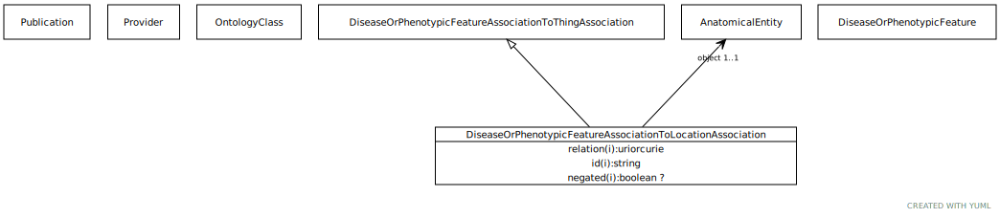

# Type: disease or phenotypic feature association to location association

An association between either a disease or a phenotypic feature and an anatomical entity, where the disease/feature manifests in that site.

URI: [biolink:DiseaseOrPhenotypicFeatureAssociationToLocationAssociation](https://w3id.org/biolink/vocab/DiseaseOrPhenotypicFeatureAssociationToLocationAssociation)

## Parents

 *  is_a: [DiseaseOrPhenotypicFeatureAssociationToThingAssociation](DiseaseOrPhenotypicFeatureAssociationToThingAssociation.md)

## Referenced by class

## Attributes

### Own

 * [disease or phenotypic feature association to location association➞object](disease_or_phenotypic_feature_association_to_location_association_object.md)  REQ
    * Description: anatomical entity in which the disease or feature is found
    * range: [AnatomicalEntity](AnatomicalEntity.md)
    * Example:    

### Inherited from disease or phenotypic feature association to thing association:

 * [association type](association_type.md)  OPT
    * Description: connects an association to the type of association (e.g. gene to phenotype)
    * range: [OntologyClass](OntologyClass.md)
 * [association➞id](association_id.md)  REQ
    * Description: A unique identifier for an association
    * range: [String](types/String.md)
    * in subsets: (translator_minimal)
 * [disease or phenotypic feature association to thing association➞subject](disease_or_phenotypic_feature_association_to_thing_association_subject.md)  REQ
    * Description: disease or phenotype
    * range: [DiseaseOrPhenotypicFeature](DiseaseOrPhenotypicFeature.md)
    * Example:    
    * Example:    
 * [negated](negated.md)  OPT
    * Description: if set to true, then the association is negated i.e. is not true
    * range: [Boolean](types/Boolean.md)
 * [provided by](provided_by.md)  0..*
    * Description: connects an association to the agent (person, organization or group) that provided it
    * range: [Provider](Provider.md)
 * [publications](publications.md)  0..*
    * Description: connects an association to publications supporting the association
    * range: [Publication](Publication.md)
 * [qualifiers](qualifiers.md)  0..*
    * Description: connects an association to qualifiers that modify or qualify the meaning of that association
    * range: [OntologyClass](OntologyClass.md)
 * [relation](relation.md)  REQ
    * Description: The relation which describes an association between a subject and an object in a more granular manner. Usually this is a term from Relation Ontology, but it can be any edge CURIE.
    * range: [Uriorcurie](types/Uriorcurie.md)
